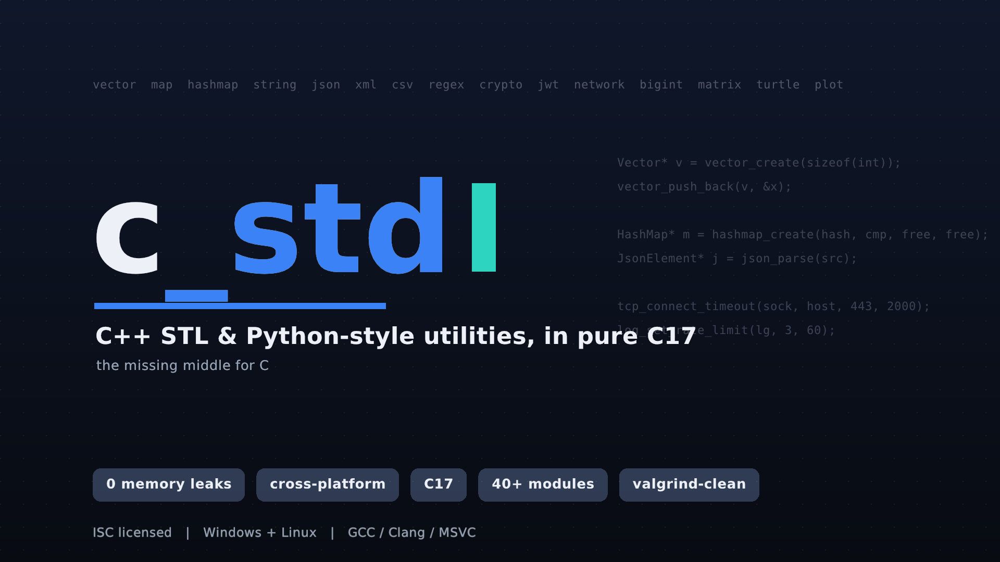
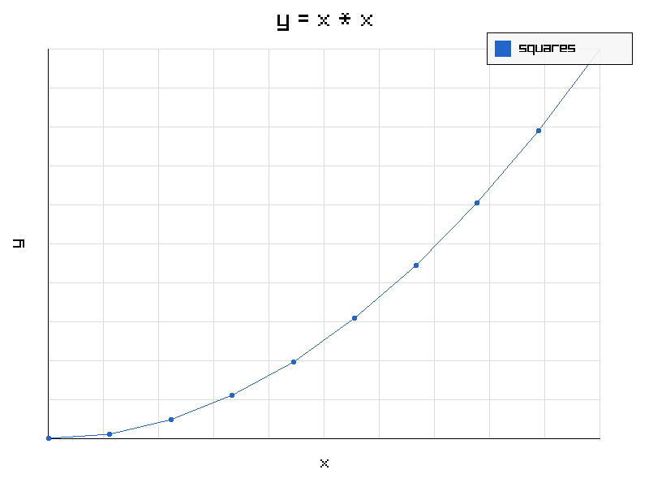
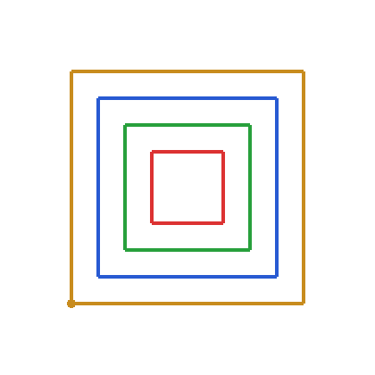

# C STL — C++ Standard Library & Python-style utilities, reimplemented in C

<p align="center">
  
</p>

This project reimplements a large slice of the **C++ Standard Library** (containers,
algorithms, smart pointers, …) together with many **Python-style conveniences**
(`statistics`, `random`, `secrets`, `json`, `regex`, …) in pure **C17**. The goal is
to give C developers familiar, well-documented building blocks — dynamic arrays,
maps, strings, JSON, networking, big integers, and much more — without leaving the C
ecosystem.


## Highlights

- **Zero memory leaks.** Every module, test suite, and README example is verified
  under Valgrind (`--leak-check=full`) — `0 leaks, 0 errors`. Network/socket code is
  additionally checked for descriptor leaks (`--track-fds=yes`).

- **Cross-platform.** Builds and runs on **Windows** (MSVC and MinGW-w64) and
  **Linux** (GCC/Clang), with POSIX/Win32 backends behind one API. Compiles cleanly
  under `-Wall -Wextra`.

- **Pure C17.** No C++ — just portable standard C with thin platform shims.

- **40+ modules.** Containers, algorithms, smart pointers, strings, JSON/XML/CSV/INI,
  networking (TCP/UDP/HTTP), crypto & JWT, arbitrary-precision math, graphics, and more.

- **Familiar APIs.** Modeled on the C++ STL (`vector`, `map`, `unique_ptr`, …) and the
  Python standard library (`random`, `statistics`, `json`, `regex`, `turtle`, …).

- **Heavily tested with true results.** Deep per-module test suites, plus runnable
  examples in every README whose shown output is captured from a real run.

- **Fast & predictable.** Efficient data structures (pooled `vector` growth, O(1)
  average `hashmap`, O(log n) `map`), clear ownership rules and deallocators.

- **CMake build.** Build the whole library, a single module, or one example at a time,
  with GCC, Clang, or MSVC.

## A personal note

I undertake this project out of a deep affection for the C programming language. C
remains an essential tool for any computer engineer, providing the foundation needed
to build efficient and robust software. This effort aims to enrich the language with
the conveniences found in higher-level standard libraries.

---

## Table of contents

- [Highlights](#highlights)
- [Modules](#modules)
- [Dependencies](#dependencies)
- [Installing the dependencies](#installing-the-dependencies)
  - [Windows (MSYS2 / MinGW-w64)](#windows-msys2--mingw-w64)
  - [Debian / Ubuntu](#debian--ubuntu)
  - [Fedora](#fedora)
- [Building with CMake](#building-with-cmake)
  - [Build everything](#build-everything)
  - [Build / run one piece at a time](#build--run-one-piece-at-a-time)
  - [Choosing a compiler (GCC / Clang / MSVC)](#choosing-a-compiler-gcc--clang--msvc)
  - [Build options](#build-options)
- [Examples](#examples)
- [Per-module documentation](#per-module-documentation)
- [Contributing](#contributing)
- [License](#license)

---

## Modules

Every module lives in its own directory with a `.c` source, a `.h` header, and a
`README.md` containing a full API reference and runnable examples.

### Containers
| Module | Analogous to | Description |
|--------|--------------|-------------|
| `array` | `std::array` | Fixed-size array wrapper with bounds-checked access. |
| `vector` | `std::vector` | Dynamic, automatically resizing array with memory pooling. |
| `string` | `std::string` | Growable string with a rich manipulation API (`string/std_string.h`). |
| `list` | `std::list` | Doubly linked list. |
| `forward_list` | `std::forward_list` | Singly linked list. |
| `deque` | `std::deque` | Double-ended queue with fast insertion/removal at both ends. |
| `queue` | `std::queue` | FIFO queue. |
| `stack` | `std::stack` | LIFO stack. |
| `priority_queue` | `std::priority_queue` | Heap-backed priority queue with a custom comparator. |
| `span` | `std::span` | Non-owning view over a contiguous sequence. |
| `bitset` | `std::bitset` | Fixed-size sequence of bits with bitwise operations. |
| `map` | `std::map` | Ordered associative container (Red-Black tree, O(log n)). |
| `hashmap` | `std::unordered_map` | Hash table with O(1) average insert/lookup and automatic rehashing. |
| `set` | `std::set` | Ordered, unique associative container (Red-Black tree, O(log n)); |
| `tuple` | `std::tuple` | Fixed-size heterogeneous collection. |
| `variant` | `std::variant` | Type-safe tagged union with a visitor interface. |
| `uniqueptr` | `std::unique_ptr` | RAII smart pointer with automatic, scope-based cleanup. |

### Algorithms & numerics
| Module | Description |
|--------|-------------|
| `algorithm` | Generic algorithms inspired by `<algorithm>`: sort, search, transform, accumulate, … |
| `sort` | Stand-alone sorting library: 8+ algorithms, benchmarking and search helpers. |
| `statistics` | Mean, median, variance, … (mirrors Python's `statistics`). |
| `random` | Pseudo-random numbers and sequence helpers (mirrors Python's `random`). |
| `secrets` | Cryptographically secure random numbers/tokens and constant-time comparison. |
| `numbers` | Mathematical constants (header-only, like C++20 `<numbers>`). |
| `matrix` | Matrix creation, manipulation and linear-algebra operations. |
| `bigint` | Arbitrary-precision integers (backed by **GMP**). |
| `bigfloat` | Arbitrary-precision floating point (backed by **MPFR**). |
| `evalexpr` | Runtime arithmetic-expression evaluator. |

### Text, data & I/O
| Module | Description |
|--------|-------------|
| `fmt` | Formatting / I/O library inspired by Go's `fmt`, with Unicode support. |
| `encoding` | Base64 / Base32 / Base16 / URL encoding and decoding. |
| `json` | Parse, generate and manipulate JSON. |
| `xml` | Parse, create, modify and traverse XML documents. |
| `csv` | Read, write and manipulate CSV files. |
| `config` | Read/modify/save INI-style configuration files. |
| `regex` | Regular-expression compile/match/search (PCRE on Windows, POSIX on Linux). |
| `cli` | Command-line argument/option/sub-command parser. |
| `log` | Leveled logging (DEBUG…FATAL) to console and/or file. |
| `file_io` | `FileReader` / `FileWriter` with text and binary (UTF-8/UTF-16) modes. |
| `dir` | Directory and filesystem manipulation. |

### Time & date
| Module | Description |
|--------|-------------|
| `time` | Time measurement and manipulation (`time/std_time.h`). |
| `date` | Gregorian and Persian calendar dates, conversions and arithmetic. |

### System & concurrency
| Module | Description |
|--------|-------------|
| `sysinfo` | OS / hardware information (Windows & Linux). |
| `concurrent` | Threads, mutexes, condition variables, semaphore and a thread pool. |
| `serial_port` | Serial-port (RS-232) communication. |

### Security
| Module | Description |
|--------|-------------|
| `crypto` | Hashing, encryption/decryption and other primitives (backed by **OpenSSL**). |
| `jwt` | JSON Web Token creation/verification (HS/RS/ES/PS families). |

### Networking & databases
| Module | Description |
|--------|-------------|
| `network` | TCP and UDP sockets plus a small HTTP server/client. |
| `database` | PostgreSQL client built on **libpq** (optional — only built when libpq is present). |

### Graphics
| Module | Description |
|--------|-------------|
| `plot` | 2-D plotting (line/scatter/bar) built on **raylib**. |
| `turtle` | Turtle graphics, inspired by Python's `turtle` (built on **raylib**). |

### Testing
| Module | Description |
|--------|-------------|
| `unittest` | Lightweight unit-testing framework (assertions, suites, fixtures). |

---

## Dependencies

To build the whole project you need:

**Build tools**
- **CMake** ≥ 3.15
- A **C17** compiler — GCC, Clang, or MSVC
- A generator — **Ninja** (recommended) or Make / Visual Studio

**Third-party libraries** (installed system-wide via your package manager)

| Library | Used by | Required? |
|---------|---------|-----------|
| **OpenSSL** (`libssl`, `libcrypto`) | `crypto`, `jwt`, `network` | Yes |
| **raylib** | `plot`, `turtle` | Yes |
| **GMP** | `bigint` | Yes |
| **MPFR** | `bigfloat` | Yes |
| **PostgreSQL / libpq** | `database` | Optional — the `database` module is skipped automatically if libpq is missing |
| **pthreads** | `concurrent`, `network` | Provided by the toolchain (winpthread on Windows) |

> The project no longer uses the old `compile.py` script — the build is **CMake-only**.

---

## Installing the dependencies

### Windows (MSYS2 / MinGW-w64)

Install [MSYS2](https://www.msys2.org/) (this project assumes it lives at `C:\msys64`).
Open the **“MSYS2 MinGW x64”** shell and run:

```bash
pacman -Syu          # update once (re-open the shell if it asks you to)

pacman -S --needed \
  mingw-w64-x86_64-toolchain \
  mingw-w64-x86_64-clang \
  mingw-w64-x86_64-cmake \
  mingw-w64-x86_64-ninja \
  mingw-w64-x86_64-openssl \
  mingw-w64-x86_64-raylib \
  mingw-w64-x86_64-gmp \
  mingw-w64-x86_64-mpfr \
  mingw-w64-x86_64-postgresql
```

Always build from the **MinGW x64** shell (not the plain *MSYS* shell) so that
`C:\msys64\mingw64\bin` is on the `PATH` and CMake picks up the right compiler and
libraries.

### Debian / Ubuntu

```bash
sudo apt update
sudo apt install \
  build-essential clang cmake ninja-build pkg-config \
  libssl-dev libgmp-dev libmpfr-dev libpq-dev libraylib-dev
```

> `libraylib-dev` is available on Debian 12+ / Ubuntu 22.04+. On older releases,
> install raylib from source (<https://github.com/raysan5/raylib>) or omit the
> `plot`/`turtle` modules.

### Fedora

```bash
sudo dnf install \
  gcc clang cmake ninja-build pkgconf-pkg-config \
  openssl-devel gmp-devel mpfr-devel libpq-devel raylib-devel
```

---

## Building with CMake

All commands are run from the project root (`c_std/`).

### Build everything

```bash
# Configure (Ninja generator recommended). Omit -G for the platform default.
cmake -S . -B build -G Ninja

# Build the library, the main demo
cmake --build build

# Build and run the main demo (runs from the project root so ./sources is reachable)
cmake --build build --target run
```

Binaries are written to `build/bin/`.

### Build / run one piece at a time

The project is fully modular — you can compile a single module or a single example
without building the rest:

```bash
# Compile just one module's objects
cmake --build build --target vector

# Compile every module library (no executables)
cmake --build build --target modules

```

### Choosing a compiler (GCC / Clang / MSVC)

The build is compiler-agnostic and targets the **C17** standard.

```bash
# GCC (default on MSYS2 / Linux)
cmake -S . -B build -G Ninja -DCMAKE_C_COMPILER=gcc

# Clang
cmake -S . -B build -G Ninja -DCMAKE_C_COMPILER=clang
# On MSYS2, `clang` is usually the CLANG64 toolchain, whose linker does not search
# the MinGW-w64 library directory. If you installed the dependencies into mingw64,
# point clang's linker at them:
#   cmake -S . -B build -G Ninja -DCMAKE_C_COMPILER=clang \
#         -DCMAKE_EXE_LINKER_FLAGS="-LC:/msys64/mingw64/lib"

# MSVC — from an “x64 Native Tools Command Prompt for VS”
cmake -S . -B build -G "Ninja"            # or: -G "Visual Studio 17 2022"
cmake --build build --config Release
```

On MSVC, install the third-party libraries with [vcpkg](https://vcpkg.io)
(`vcpkg install openssl raylib gmp mpfr libpq`) and pass
`-DCMAKE_TOOLCHAIN_FILE=<vcpkg>/scripts/buildsystems/vcpkg.cmake` when configuring.

### Build options

| Option | Default | Effect |
|--------|---------|--------|
| `C_STD_BUILD_MAIN` | `ON` | Build the `main` demo executable. |


---

## Examples

The `examples/` directory contains a small, self-contained program for (almost)
every module — `examples/<module>_example.c` — taken from that module's `README.md`.
Each one is compiled by CMake into its own executable named `<module>_example`, so
you can build and run them individually (see
[Build / run one piece at a time](#build--run-one-piece-at-a-time)).

A few examples are **compile-only** because they need external resources at run time:
`network` (sockets), `database` (a running PostgreSQL server), `serial_port`
(hardware), and `plot` / `turtle` (open a graphical window).

---

## Quick examples

A taste of a few modules. Each snippet is a complete program; the per-module
`README.md` files have many more (with expected output).

### vector — a growable typed array

```c
#include "vector/vector.h"
#include "fmt/fmt.h"

int main(void) {
    Vector* v = vector_create(sizeof(int));
    for (int i = 1; i <= 5; ++i) {
        vector_push_back(v, &i);
    }

    int sum = 0;
    for (size_t i = 0; i < vector_size(v); ++i) {
        sum += *(int*)vector_at(v, i);
    }

    fmt_printf("size=%zu sum=%d\n", vector_size(v), sum);
    vector_deallocate(v);
    return 0;
}
```
```
size=5 sum=15
```

### json — parse and pretty-print

```c
#include "json/json.h"
#include "fmt/fmt.h"

int main(void) {
    JsonElement* root = json_parse("{\"lib\": \"c_std\", \"version\": 1.0, \"tags\": [\"c\", \"stl\"]}");

    json_print(root);
    json_deallocate(root);

    return 0;
}
```
```
{
    "lib": "c_std",
    "tags": [
      "c",
      "stl"
  ],
    "version": 1
}
```

### csv — build a row and export

```c
#include "csv/csv.h"
#include "fmt/fmt.h"
#include <stdlib.h>

int main(void) {
    CsvFile* csv = csv_file_create(',');
    CsvRow*  row = csv_row_create();

    csv_row_append_cell(row, "Alice");
    csv_row_append_cell(row, "30");
    csv_file_append_row(csv, row);

    char* out = csv_file_export_to_string(csv);
    fmt_printf("%s", out);

    free(out);
    csv_file_destroy(csv);
    return 0;
}
```
```
Alice,30
```

### config — load an INI file and read values

```c
#include "config/config.h"
#include "fmt/fmt.h"
#include <stdio.h>

int main(void) {
    /* write a small INI file, then load and read it */
    FILE* f = fopen("app.ini", "w");
    fputs("[server]\nhost = localhost\nport = 8080\n", f);
    fclose(f);

    ConfigFile* cfg = config_create("app.ini");
    fmt_printf("host=%s port=%d\n",
               config_get_value(cfg, "server", "host"),
               config_get_int(cfg, "server", "port", 0));

    config_deallocate(cfg);
    remove("app.ini");

    return 0;
}
```
```
host=localhost port=8080
```

### random — deterministic with a fixed seed

```c
#include "random/random.h"
#include "fmt/fmt.h"

int main(void) {
    random_seed(42);
    fmt_printf("dice rolls: %d %d %d\n", random_randint(1, 6), random_randint(1, 6), random_randint(1, 6));
    
    return 0;
}
```
```
dice rolls: 4 5 1
```

### crypto — SHA-256 of a string

```c
#include "crypto/crypto.h"
#include "fmt/fmt.h"
#include <stdlib.h>

int main(void) {
    size_t   n;
    uint8_t* h   = crypto_hash_string("hello", CRYPTO_SHA256, &n);
    char*    hex = crypto_hash_to_hex(h, n);

    fmt_printf("sha256(\"hello\") = %s\n", hex);

    free(hex);
    free(h);

    return 0;
}
```
```
sha256("hello") = 2cf24dba5fb0a30e26e83b2ac5b9e29e1b161e5c1fa7425e73043362938b9824
```

### concurrent — spawn a thread and join it

```c
#include "concurrent/concurrent.h"
#include "fmt/fmt.h"

static int worker(void* arg) { *(int*)arg += 41; return 0; }

int main(void) {
    int value = 1;
    Thread t;

    thread_create(&t, worker, &value);
    thread_join(t, NULL);
    fmt_printf("value=%d\n", value);

    return 0;
}
```
```
value=42
```

### thread_pool — run 100 tasks on 4 workers

```c
#include "concurrent/thread_pool.h"
#include "concurrent/concurrent.h"
#include "fmt/fmt.h"

static Mutex m;
static int counter = 0;

static int task(void* arg) { 
    (void)arg; 

    mutex_lock(&m); 
    counter++; 
    mutex_unlock(&m); 

    return 0; 
}

int main(void) {
    mutex_init(&m, MUTEX_PLAIN);
    ThreadPool* pool = thread_pool_create(4);


    for (int i = 0; i < 100; ++i) {
        thread_pool_add_task(pool, task, NULL);
    }
    thread_pool_wait(pool);
    fmt_printf("ran %d tasks\n", counter);

    thread_pool_destroy(pool);
    mutex_destroy(&m);

    return 0;
}
```
```
ran 100 tasks
```

### udp — open a socket and bind to an ephemeral port

```c
#include "network/udp.h"
#include "fmt/fmt.h"

int main(void) {
    udp_init();
    UdpSocket sock;

    udp_socket_create(&sock);
    udp_bind(sock, NULL, 0);                 /* any address, kernel-chosen port */

    char host[INET6_ADDRSTRLEN];
    unsigned short port = 0;

    udp_get_local_address(sock, host, sizeof(host), &port);
    fmt_printf("udp socket bound to an ephemeral port: %s\n", port != 0 ? "yes" : "no");

    udp_close(sock);
    udp_cleanup();

    return 0;
}
```
```
udp socket bound to an ephemeral port: yes
```

### tcp — create a listening server socket

```c
#include "network/tcp.h"
#include "fmt/fmt.h"

int main(void) {
    tcp_init();
    TcpSocket server;

    tcp_socket_create(&server);
    tcp_set_reuse_addr(server, true);
    tcp_bind(server, "127.0.0.1", 0);        /* ephemeral port */
    tcp_listen(server, 1);

    char host[INET6_ADDRSTRLEN];
    unsigned short port = 0;

    tcp_get_sock_name(server, host, sizeof(host), &port);
    fmt_printf("tcp server on %s, port assigned: %s\n", host, port != 0 ? "yes" : "no");

    tcp_close(server);
    tcp_cleanup();

    return 0;
}
```
```
tcp server on 127.0.0.1, port assigned: yes
```

### http — build and serialize a response (no network)

```c
#include "network/http.h"
#include "fmt/fmt.h"
#include <stdlib.h>

int main(void) {
    HttpResponse res = {0};

    http_set_status(&res, 200, "OK");
    http_set_body(&res, "Hello, world!");

    char* raw = http_serialize_response(&res);
    fmt_printf("%s", raw);

    free(raw);
    http_free_response(&res);

    return 0;
}
```
```
HTTP/1.1 200 OK
Content-Type: text/plain

Hello, world!
```

### plot — render a line chart to a PNG

```c
#include "plot/plot.h"

int main(void) {
    Plot* p = plot_create("y = x * x", "x", "y");

    float ys[10];
    for (int i = 0; i < 10; ++i) ys[i] = (float)(i * i);

    PlotColor blue = {34, 102, 204, 255};
    plot_add_line(p, ys, 10, "squares", blue);

    plot_export_image(p, "plot_example.png");   /* writes a PNG to disk */
    plot_destroy(p);
    
    return 0;
}
```



### turtle — turtle graphics, saved as a PNG

`turtle` is built on raylib; here we draw four nested squares and save the
canvas with the built-in `turtle_save_image` (a wrapper over raylib's
`TakeScreenshot`, so you don't need to include `raylib.h`). Turtle coordinates
are screen pixels (origin top-left).

```c
#include "turtle/turtle.h"

int main(void) {
    Turtle* t = turtle_create();

    turtle_init_window(420, 420, "c_std turtle");
    turtle_set_fps(60);
    turtle_set_speed(t, 100);                    /* fast (0 would never finish) */
    turtle_set_background_color(t, 255, 255, 255, 255);
    turtle_pen_size(t, 4);

    unsigned char colors[4][3] = {{220,50,50}, {40,160,60}, {40,90,210}, {200,140,30}};
    for (int s = 0; s < 4; ++s) {
        float side = 80.0f + s * 60.0f;

        turtle_pen_up(t);
        turtle_set_position(t, 210.0f - side / 2.0f, 210.0f + side / 2.0f);  /* center it */
        turtle_set_heading(t, 0);
        turtle_pen_down(t);
        turtle_set_pen_color_rgb(t, colors[s][0], colors[s][1], colors[s][2], 255);

        for (int i = 0; i < 4; ++i) {            /* one square */
            turtle_forward(t, side);
            turtle_right(t, 90);
        }
    }
    turtle_draw(t);

    turtle_save_image("turtle_example.png");     /* built-in screenshot helper */
    turtle_deallocate(t);
    turtle_close_window();

    return 0;
}
```



---

## Per-module documentation

Each module ships its own `README.md` with a complete API reference, function
descriptions, and runnable examples that include their expected output. Start with
the module directory you are interested in — e.g. [`vector/README.md`](vector/README.md),
[`json/README.md`](json/README.md), or [`algorithm/README.md`](algorithm/README.md).

---

## Contributing

Contributions are welcome — extending libraries, improving performance, or fixing
bugs. Fork the repository, make your changes, and submit a pull request. New modules
just need their directory added to the `C_STD_MODULES` list in `CMakeLists.txt`.

## License

This project is open-source and available under the [ISC License](LICENSE).
