# Plot Library in C

**Author:** amin tahmasebi
**Release Date:** 2025
**License:** ISC License

## Overview

The `plot` module is a small charting layer built on top of
[raylib](https://www.raylib.com/). A single `Plot` object holds up to
`PLOT_MAX_SERIES` (8) data series, each of which can be rendered as a
line, bar, scatter, pie slice set, or histogram. The same plot can be
shown in a live window with `plot_draw` or rendered headlessly to a PNG
with `plot_export_image` — both paths share the exact same drawing
code so what you see on screen is what you get on disk.

The library is intentionally minimal: there is no animation, no
interactivity, no axis ticks/labels beyond a global title and one
label per axis. It is designed for embedding small static charts into
applications, dashboards, and reports without pulling in a full GUI
framework.

## Features

- Up to 8 series per plot, each with its own color, label, type
- Plot types: **line**, **bar**, **scatter**, **pie**, **histogram**
- Automatic x/y range computation across all series
- Optional grid and legend
- Per-element color overrides (background, grid, axis, legend bg/text)
- PNG export — full plot is rendered offscreen via a hidden raylib
  window
- All public APIs are `NULL`-safe and return `false`/`NULL`/`-1` on
  bad input rather than crashing
- All public functions have Doxygen comments above their
  implementations in [`plot.c`](plot.c)

## Quick reference

| Category   | Functions |
|------------|-----------|
| Lifecycle  | `plot_create`, `plot_destroy` |
| Series     | `plot_add_series`, `plot_add_line`, `plot_add_bar`, `plot_add_scatter`, `plot_update_series_data`, `plot_remove_series`, `plot_clear_series`, `plot_get_series_count`, `plot_has_series` |
| Style      | `plot_set_window_size`, `plot_set_size`, `plot_set_title`, `plot_set_axis_labels`, `plot_set_legend`, `plot_set_grid`, `plot_set_colors`, `plot_set_background_color`, `plot_set_grid_color`, `plot_set_axis_color`, `plot_set_legend_colors` |
| Colors     | `plot_color`, `plot_color_rgb`, `plot_color_hex` |
| Render     | `plot_draw`, `plot_export_image` |

---

## Function Definitions

---

### `Plot* plot_create(const char* title, const char* xLabel, const char* yLabel)`

**Purpose**:  
Allocates and initializes a new `Plot` object with default styling: white background, light-grey grid, black axes, 800×600 pixels, legend and grid both enabled, and an empty series array. The plot owns deep copies of every string argument.

**Parameters**:  
- `title`: Window/chart title string. May be `NULL` (defaults to an empty string).
- `xLabel`: Horizontal-axis label. May be `NULL`.
- `yLabel`: Vertical-axis label. May be `NULL`.

**Return Value**:  
A pointer to the newly created `Plot`, or `NULL` on memory allocation failure.

**Usage Case**:  
Call at the start of any charting session to obtain a fresh `Plot` before adding series, adjusting style, and rendering.

---

### `void plot_destroy(Plot* plot)`

**Purpose**:  
Frees all memory owned by the plot: per-series data arrays and labels, the title, and both axis-label strings. The `Plot` struct itself is also freed.

**Parameters**:  
- `plot`: The plot to destroy. Passing `NULL` is safe (no-op).

**Return Value**:  
None.

**Usage Case**:  
Always call `plot_destroy` at the end of a charting session to prevent memory leaks.

---

### `int plot_add_series(Plot* plot, const float* xData, const float* yData, size_t dataSize, const char* label, PlotType pltype, PlotColor color)`

**Purpose**:  
Appends a new data series to the plot. The plot makes its own heap copies of `xData`, `yData`, and `label`, so the caller may free them immediately. Passing `NULL` for `xData` auto-generates implicit indices `0..dataSize-1`.

**Parameters**:  
- `plot`: Target plot. Must not be `NULL`.
- `xData`: Array of `dataSize` x-values, or `NULL` for implicit indices.
- `yData`: Array of `dataSize` y-values. Must not be `NULL`.
- `dataSize`: Number of data points.
- `label`: Series legend label. May be `NULL`.
- `pltype`: One of `PLTYPE_LINE`, `PLTYPE_BAR`, `PLTYPE_SCATTER`, `PLTYPE_PIE`, `PLTYPE_HISTOGRAM`.
- `color`: Series color (use the `plot_color*` helpers).

**Return Value**:  
Zero-based index of the new series on success; `-1` on bad input, a full plot (`PLOT_MAX_SERIES` reached), or OOM.

**Usage Case**:  
Use when you need full control over chart type and x-data. For common cases prefer `plot_add_line`, `plot_add_bar`, or `plot_add_scatter`.

---

### `int plot_add_line(Plot* plot, const float* y, size_t n, const char* label, PlotColor color)`

**Purpose**:  
Convenience wrapper around `plot_add_series` for `PLTYPE_LINE` with implicit x-indices (`0..n-1`).

**Parameters**:  
- `plot`: Target plot.
- `y`: Array of `n` y-values.
- `n`: Number of data points.
- `label`: Legend label. May be `NULL`.
- `color`: Line color.

**Return Value**:  
Index of the new series, or `-1` on failure (same conditions as `plot_add_series`).

**Usage Case**:  
The most common way to add a line chart series when x-values are evenly spaced indices.

---

### `int plot_add_scatter(Plot* plot, const float* x, const float* y, size_t n, const char* label, PlotColor color)`

**Purpose**:  
Convenience wrapper around `plot_add_series` for `PLTYPE_SCATTER` with explicit x and y arrays.

**Parameters**:  
- `plot`: Target plot.
- `x`: Array of `n` x-coordinates.
- `y`: Array of `n` y-coordinates.
- `n`: Number of data points.
- `label`: Legend label. May be `NULL`.
- `color`: Point color.

**Return Value**:  
Index of the new series, or `-1` on failure.

**Usage Case**:  
Use when both x and y coordinates are independently meaningful — for example, plotting `(time, value)` pairs or correlation data.

---

### `int plot_add_bar(Plot* plot, const float* y, size_t n, const char* label, PlotColor color)`

**Purpose**:  
Convenience wrapper around `plot_add_series` for `PLTYPE_BAR` with implicit x-indices.

**Parameters**:  
- `plot`: Target plot.
- `y`: Array of `n` bar heights.
- `n`: Number of bars.
- `label`: Legend label. May be `NULL`.
- `color`: Bar fill color.

**Return Value**:  
Index of the new series, or `-1` on failure.

**Usage Case**:  
Use for categorical data such as monthly sales, benchmark results, or frequency counts.

---

### `bool plot_update_series_data(Plot* plot, size_t seriesIndex, const float* xData, const float* yData, size_t dataSize)`

**Purpose**:  
Replaces the x/y data arrays of an existing series in place while preserving its label, color, and plot type. The plot makes deep copies of the new data arrays.

**Parameters**:  
- `plot`: Target plot.
- `seriesIndex`: Zero-based index of the series to update.
- `xData`: New x array, or `NULL` for implicit indices.
- `yData`: New y array. Must not be `NULL`.
- `dataSize`: Number of new data points.

**Return Value**:  
`true` on success; `false` on bad input (`plot` or `yData` is `NULL`, `seriesIndex` out of range, or OOM).

**Usage Case**:  
Use when refreshing live data in a series without having to rebuild the plot from scratch — for example, updating a real-time chart each tick.

---

### `bool plot_remove_series(Plot* plot, size_t seriesIndex)`

**Purpose**:  
Deletes the series at `seriesIndex` and shifts all subsequent series down one position, so indices remain contiguous.

**Parameters**:  
- `plot`: Target plot.
- `seriesIndex`: Zero-based index of the series to remove.

**Return Value**:  
`true` on success; `false` if `plot` is `NULL` or `seriesIndex` is out of range.

**Usage Case**:  
Use to dynamically remove a specific series — for example, when a data stream ends or a user deselects a legend entry.

---

### `void plot_clear_series(Plot* plot)`

**Purpose**:  
Drops every series attached to the plot, freeing their data arrays and labels, while leaving the plot's title, colors, and size intact.

**Parameters**:  
- `plot`: Target plot. Passing `NULL` is a safe no-op.

**Return Value**:  
None.

**Usage Case**:  
Use to reset the data on a plot object so it can be re-used with a new dataset without creating a new `Plot`.

---

### `size_t plot_get_series_count(const Plot* plot)`

**Purpose**:  
Returns the number of series currently attached to the plot.

**Parameters**:  
- `plot`: The plot to query. May be `NULL`.

**Return Value**:  
Number of attached series, or `0` if `plot` is `NULL`.

**Usage Case**:  
Use before iterating over series indices to avoid out-of-bounds access.

---

### `bool plot_has_series(const Plot* plot, size_t index)`

**Purpose**:  
Checks whether `index` refers to a valid (in-range) series slot.

**Parameters**:  
- `plot`: The plot to query. May be `NULL`.
- `index`: Series index to test.

**Return Value**:  
`true` if `index < plot_get_series_count(plot)`, otherwise `false`.

**Usage Case**:  
Use as a guard before calling accessors or mutators on a specific series index.

---

### `bool plot_set_size(Plot* plot, int width, int height)`

**Purpose**:  
Sets the plot's render dimensions. This is the **strict** setter: it rejects non-positive values.

**Parameters**:  
- `plot`: Target plot.
- `width`: Desired width in pixels. Must be > 0.
- `height`: Desired height in pixels. Must be > 0.

**Return Value**:  
`true` if the dimensions were applied; `false` if either value is ≤ 0 or `plot` is `NULL`.

**Usage Case**:  
Use when you need a precise canvas size and want explicit failure on bad input rather than silent clamping.

---

### `void plot_set_window_size(Plot* plot, int width, int height)`

**Purpose**:  
Sets the plot's render dimensions with **lenient** clamping: both `width` and `height` are silently raised to a minimum of 100 if they fall below that threshold.

**Parameters**:  
- `plot`: Target plot. Passing `NULL` is a safe no-op.
- `width`: Desired width in pixels (clamped to ≥ 100).
- `height`: Desired height in pixels (clamped to ≥ 100).

**Return Value**:  
None.

**Usage Case**:  
Use when you prefer not to validate dimensions yourself and are happy with a sensible floor.

---

### `bool plot_set_title(Plot* plot, const char* title)`

**Purpose**:  
Replaces the plot's title with a heap-owned deep copy of `title`. The caller retains ownership of its original string.

**Parameters**:  
- `plot`: Target plot.
- `title`: New title string. Passing `NULL` clears the title.

**Return Value**:  
`true` on success; `false` if `plot` is `NULL` or OOM.

**Usage Case**:  
Use after initial creation when the final title isn't known until later — for example, once data is loaded.

---

### `bool plot_set_axis_labels(Plot* plot, const char* xLabel, const char* yLabel)`

**Purpose**:  
Replaces both axis labels atomically: if either copy fails, neither label is changed. Both strings are deep-copied; the caller retains its originals.

**Parameters**:  
- `plot`: Target plot.
- `xLabel`: New x-axis label. May be `NULL` to clear.
- `yLabel`: New y-axis label. May be `NULL` to clear.

**Return Value**:  
`true` on success; `false` if `plot` is `NULL` or OOM.

**Usage Case**:  
Use to relabel axes after loading data — for example, once you know the units of measurement.

---

### `void plot_set_legend(Plot* plot, bool show)`

**Purpose**:  
Toggles whether the series legend is drawn on the chart.

**Parameters**:  
- `plot`: Target plot. Passing `NULL` is a safe no-op.
- `show`: `true` to show the legend, `false` to hide it.

**Return Value**:  
None.

**Usage Case**:  
Hide the legend for single-series plots or pie charts where labels are embedded in slices.

---

### `void plot_set_grid(Plot* plot, bool show)`

**Purpose**:  
Toggles whether background grid lines are drawn on the chart.

**Parameters**:  
- `plot`: Target plot. Passing `NULL` is a safe no-op.
- `show`: `true` to show grid lines, `false` to hide them.

**Return Value**:  
None.

**Usage Case**:  
Disable the grid for cleaner pie charts or for minimalist styling.

---

### `void plot_set_colors(Plot* plot, PlotColor bg, PlotColor grid, PlotColor axis, PlotColor legendBg, PlotColor legendText)`

**Purpose**:  
Sets all five styling palette slots in a single call. Equivalent to calling the five per-aspect setters in sequence.

**Parameters**:  
- `plot`: Target plot. Passing `NULL` is a safe no-op.
- `bg`: Background fill color.
- `grid`: Grid line color.
- `axis`: Axis line and tick color.
- `legendBg`: Legend box background color.
- `legendText`: Legend label text color.

**Return Value**:  
None.

**Usage Case**:  
Use when applying a complete custom palette to replace the defaults in one shot. Use the per-aspect setters when you only want to change one slot.

---

### `void plot_set_background_color(Plot* plot, PlotColor c)`

**Purpose**:  
Sets the chart's background fill color.

**Parameters**:  
- `plot`: Target plot. Passing `NULL` is a safe no-op.
- `c`: New background color.

**Return Value**:  
None.

**Usage Case**:  
Use to set a dark background without touching the other palette slots.

---

### `void plot_set_grid_color(Plot* plot, PlotColor c)`

**Purpose**:  
Sets the color of the background grid lines.

**Parameters**:  
- `plot`: Target plot. Passing `NULL` is a safe no-op.
- `c`: New grid color.

**Return Value**:  
None.

**Usage Case**:  
Use to match grid lines to a custom background — for example, a slightly lighter shade of a dark background.

---

### `void plot_set_axis_color(Plot* plot, PlotColor c)`

**Purpose**:  
Sets the color of the plot's axis lines and tick marks.

**Parameters**:  
- `plot`: Target plot. Passing `NULL` is a safe no-op.
- `c`: New axis color.

**Return Value**:  
None.

**Usage Case**:  
Use to make axes visible against a dark background or to match a brand color.

---

### `void plot_set_legend_colors(Plot* plot, PlotColor bg, PlotColor text)`

**Purpose**:  
Sets the legend box background and legend label text colors simultaneously.

**Parameters**:  
- `plot`: Target plot. Passing `NULL` is a safe no-op.
- `bg`: Legend box fill color.
- `text`: Legend label text color.

**Return Value**:  
None.

**Usage Case**:  
Use to ensure the legend remains readable against the chart's background color.

---

### `PlotColor plot_color(unsigned char r, unsigned char g, unsigned char b, unsigned char a)`

**Purpose**:  
Constructs a `PlotColor` from explicit RGBA byte components. This is an inline function defined in the header.

**Parameters**:  
- `r`: Red channel (0–255).
- `g`: Green channel (0–255).
- `b`: Blue channel (0–255).
- `a`: Alpha channel (0–255; 255 = fully opaque).

**Return Value**:  
A `PlotColor` struct with the specified components.

**Usage Case**:  
Use when you need full RGBA control, including semi-transparent overlays.

---

### `PlotColor plot_color_rgb(unsigned char r, unsigned char g, unsigned char b)`

**Purpose**:  
Constructs a fully opaque `PlotColor` from RGB components (`alpha = 255`).

**Parameters**:  
- `r`: Red channel (0–255).
- `g`: Green channel (0–255).
- `b`: Blue channel (0–255).

**Return Value**:  
A `PlotColor` with `a = 255`.

**Usage Case**:  
The most common color constructor when transparency is not needed.

---

### `PlotColor plot_color_hex(unsigned int rgb_or_rgba)`

**Purpose**:  
Constructs a `PlotColor` from a packed hexadecimal integer. Accepts either `0xRRGGBB` (opaque) or `0xAARRGGBB`.

**Parameters**:  
- `rgb_or_rgba`: Packed color. Values ≤ `0x00FFFFFF` are treated as `0xRRGGBB` with `alpha = 255`; larger values are decoded as `0xAARRGGBB`.

**Return Value**:  
A `PlotColor` decoded from the packed integer.

**Usage Case**:  
The most concise way to specify colors inline: `plot_color_hex(0x2266DD)` instead of three separate bytes.

---

### `void plot_draw(Plot* plot)`

**Purpose**:  
Opens a raylib window, renders the plot, and blocks until the user closes the window. This is the only function that requires an interactive display; all other rendering goes through `plot_export_image`.

**Parameters**:  
- `plot`: The plot to display. Passing `NULL` is a safe no-op.

**Return Value**:  
None.

**Usage Case**:  
Use for interactive exploratory visualization. For headless/automated contexts use `plot_export_image` instead.

---

### `bool plot_export_image(Plot* plot, const char* filename)`

**Purpose**:  
Renders the plot off-screen using a hidden raylib window and writes the result to a PNG file. The window is opened and closed internally; the caller does not need to manage any window state.

**Parameters**:  
- `plot`: The plot to render. Must not be `NULL`.
- `filename`: Path of the output PNG file.

**Return Value**:  
`true` if the file was written successfully; `false` on any error (bad input, GL failure, or write failure).

**Usage Case**:  
The primary API for generating chart images in scripts, CI pipelines, report generators, and any headless environment.

---

### `bool plot_export_csv(const Plot* plot, const char* filename)`

**Purpose**:  
Serializes every series as columns in a CSV file. The header row uses each series' label (falling back to `series_N` for unlabeled series). Rows that extend past a shorter series' length are written with a blank cell for that column.

**Parameters**:  
- `plot`: The plot to serialize. Must not be `NULL`.
- `filename`: Output CSV path.

**Return Value**:  
`true` on success; `false` on bad input or file-write failure.

**Usage Case**:  
Use to archive the raw data behind a chart for later analysis or sharing — for example, alongside the PNG export in a reporting pipeline.

---

### `const char* plot_get_series_label(const Plot* plot, size_t index)`

**Purpose**:  
Returns a borrowed pointer to the label string of the series at `index`. The pointer is valid until the series is removed or the plot is destroyed.

**Parameters**:  
- `plot`: The plot to query.
- `index`: Zero-based series index.

**Return Value**:  
Borrowed `const char*` to the label, or `NULL` on bad input or unlabeled series. Do **not** free this pointer.

**Usage Case**:  
Use to read a label back for display or logging without modifying it.

---

### `PlotType plot_get_series_type(const Plot* plot, size_t index)`

**Purpose**:  
Returns the drawing type of the series at `index`.

**Parameters**:  
- `plot`: The plot to query.
- `index`: Zero-based series index.

**Return Value**:  
A `PlotType` enum value (`PLTYPE_LINE`, `PLTYPE_BAR`, etc.), or `PLTYPE_LINE` as a sentinel on bad input.

**Usage Case**:  
Use to inspect a series' rendering style before deciding whether to change it with `plot_set_series_type`.

---

### `PlotColor plot_get_series_color(const Plot* plot, size_t index)`

**Purpose**:  
Returns the color of the series at `index`.

**Parameters**:  
- `plot`: The plot to query.
- `index`: Zero-based series index.

**Return Value**:  
The `PlotColor` of the series, or a zero-initialized color `{0,0,0,0}` on bad input.

**Usage Case**:  
Use to read back a series color for display in a UI, export to a legend, or comparison.

---

### `size_t plot_get_series_size(const Plot* plot, size_t index)`

**Purpose**:  
Returns the number of data points in the series at `index`.

**Parameters**:  
- `plot`: The plot to query.
- `index`: Zero-based series index.

**Return Value**:  
`dataSize` of the series, or `0` on bad input.

**Usage Case**:  
Use to know how many points are in a series before iterating over its statistics or updating its data.

---

### `bool plot_set_series_label(Plot* plot, size_t index, const char* label)`

**Purpose**:  
Replaces the label of the series at `index` with a deep copy of `label`. Passing `NULL` clears the label.

**Parameters**:  
- `plot`: Target plot.
- `index`: Zero-based series index.
- `label`: New label string, or `NULL` to clear.

**Return Value**:  
`true` on success; `false` on bad input or OOM.

**Usage Case**:  
Use after data is processed and the final, human-readable name is known — for example, after parsing a file header.

---

### `bool plot_set_series_color(Plot* plot, size_t index, PlotColor color)`

**Purpose**:  
Recolors the series at `index`.

**Parameters**:  
- `plot`: Target plot.
- `index`: Zero-based series index.
- `color`: New color.

**Return Value**:  
`true` on success; `false` on bad input (`plot` is `NULL` or `index` out of range).

**Usage Case**:  
Use to apply a palette rotation or to highlight a particular series after the plot is built.

---

### `bool plot_set_series_type(Plot* plot, size_t index, PlotType type)`

**Purpose**:  
Switches the drawing style of the series at `index` without touching its data, label, or color.

**Parameters**:  
- `plot`: Target plot.
- `index`: Zero-based series index.
- `type`: New `PlotType`.

**Return Value**:  
`true` on success; `false` on bad input.

**Usage Case**:  
Use to compare how the same dataset looks as a line chart vs a bar chart vs a scatter plot — export one PNG per style.

---

### `bool plot_set_xlim(Plot* plot, float min, float max)`

**Purpose**:  
Pins the x-axis to a fixed `[min, max]` range instead of auto-scaling to the data. The range is honored by every subsequent `plot_draw` / `plot_export_image`. Points outside the range are mapped outside the plot area (and clipped by the renderer). Call `plot_autoscale` to revert.

**Parameters**:  
- `plot`: Target plot. Must be non-`NULL`.
- `min`: Lower bound of the x-axis.
- `max`: Upper bound. Must be strictly greater than `min`.

**Return Value**:  
`true` if applied; `false` if `plot` is `NULL` or the range is degenerate (`min >= max`, or either bound is `NaN`).

**Usage Case**:  
Pin a consistent scale across dashboard snapshots, zoom into a region, or fix a bar chart's baseline.

---

### `bool plot_set_ylim(Plot* plot, float min, float max)`

**Purpose**:  
The y-axis counterpart to `plot_set_xlim`. The two axes are independent — pin one and leave the other auto-scaling if you like.

**Parameters**:  
- `plot`: Target plot. Must be non-`NULL`.
- `min`: Lower bound of the y-axis.
- `max`: Upper bound. Must be strictly greater than `min`.

**Return Value**:  
`true` if applied; `false` on `NULL` plot or a degenerate range.

**Usage Case**:  
Fix a percentage axis to `0..100`, or clip outliers to a readable band.

---

### `void plot_autoscale(Plot* plot)`

**Purpose**:  
Clears any range pinned with `plot_set_xlim` / `plot_set_ylim`, so both axes auto-scale to the data again on the next render.

**Parameters**:  
- `plot`: Target plot. Passing `NULL` is a safe no-op.

**Return Value**:  
None.

**Usage Case**:  
Return to exploratory auto-ranging after a temporary zoom or fixed-scale export.

---

### `bool plot_get_xlim(const Plot* plot, float* outMin, float* outMax)`

**Purpose**:  
Reads back the **effective** x-axis range the renderer will use — the pinned range if `plot_set_xlim` was called, otherwise the range auto-computed from the data (with the same flat-data widening the renderer applies). No graphics context required.

**Parameters**:  
- `plot`: Plot to query. Must be non-`NULL`.
- `outMin`, `outMax`: Receive the bounds. Must be non-`NULL`.

**Return Value**:  
`true` on success; `false` if any argument is `NULL`, or if the axis has no pinned range and the plot holds no data to scale from.

**Usage Case**:  
Inspect, log, or persist the current scale; lay out a second chart to match.

---

### `bool plot_get_ylim(const Plot* plot, float* outMin, float* outMax)`

**Purpose**:  
The y-axis counterpart to `plot_get_xlim`.

**Parameters**:  
- `plot`: Plot to query. Must be non-`NULL`.
- `outMin`, `outMax`: Receive the bounds. Must be non-`NULL`.

**Return Value**:  
`true` on success; `false` on `NULL` arguments or when there is no pinned range and no data.

**Usage Case**:  
Read the effective vertical scale for annotations or alignment.

---

### `void plot_apply_theme_dark(Plot* plot)`

**Purpose**:  
Applies a coherent dark theme in one call: slate background, dimmed grid, light axes, and a dark legend box with light text. Series colors are **not** changed.

**Parameters**:  
- `plot`: Target plot. Passing `NULL` is a safe no-op.

**Return Value**:  
None.

**Usage Case**:  
Use when producing charts for dark-mode dashboards, presentation slides, or terminal-embedded displays.

---

### `void plot_apply_theme_light(Plot* plot)`

**Purpose**:  
Applies a symmetric light theme: white background, light-grey grid, black axes, white legend box with black text. Equivalent to the default palette but available as an explicit call.

**Parameters**:  
- `plot`: Target plot. Passing `NULL` is a safe no-op.

**Return Value**:  
None.

**Usage Case**:  
Use to reset to light styling after switching between themes, or to make the light preset explicit rather than implicit.

---

### `bool plot_series_min(const Plot* plot, size_t index, float* out)`

**Purpose**:  
Computes the minimum y-value across all data points in the series at `index` and stores it in `*out`.

**Parameters**:  
- `plot`: The plot to query.
- `index`: Zero-based series index.
- `out`: Pointer to a `float` that receives the result. Must not be `NULL`.

**Return Value**:  
`true` on success; `false` on bad input (null `plot`/`out`, empty series, or out-of-range `index`).

**Usage Case**:  
Use to annotate a chart with the actual observed minimum — for example, to label the lowest bar.

---

### `bool plot_series_max(const Plot* plot, size_t index, float* out)`

**Purpose**:  
Computes the maximum y-value across all data points in the series at `index` and stores it in `*out`.

**Parameters**:  
- `plot`: The plot to query.
- `index`: Zero-based series index.
- `out`: Receives the result. Must not be `NULL`.

**Return Value**:  
`true` on success; `false` on bad input.

**Usage Case**:  
Use to set a meaningful axis ceiling or to report peak values in a status line.

---

### `bool plot_series_sum(const Plot* plot, size_t index, float* out)`

**Purpose**:  
Sums all y-values in the series at `index` using a `double` accumulator to reduce floating-point drift, then stores the result as `float` in `*out`.

**Parameters**:  
- `plot`: The plot to query.
- `index`: Zero-based series index.
- `out`: Receives the result. Must not be `NULL`.

**Return Value**:  
`true` on success; `false` on bad input.

**Usage Case**:  
Use to compute totals — for example, total weekly users from a DAU bar chart.

---

### `bool plot_series_mean(const Plot* plot, size_t index, float* out)`

**Purpose**:  
Computes the arithmetic mean of y-values in the series at `index`, storing the result in `*out`. Uses a `double` accumulator internally.

**Parameters**:  
- `plot`: The plot to query.
- `index`: Zero-based series index.
- `out`: Receives the result. Must not be `NULL`.

**Return Value**:  
`true` on success; `false` on bad input or empty series.

**Usage Case**:  
Use for quick descriptive statistics — for example, to report average latency across a time-series plot.

---

### `bool plot_linspace(float start, float end, size_t n, float* out)`

**Purpose**:  
Fills `out` with `n` linearly-spaced values from `start` to `end` inclusive, following the same convention as NumPy `linspace`.

**Parameters**:  
- `start`: First value in the sequence.
- `end`: Last value in the sequence.
- `n`: Number of points to generate. Must be ≥ 2.
- `out`: Output array of at least `n` floats. Must not be `NULL`.

**Return Value**:  
`true` on success; `false` if `n < 2` or `out` is `NULL`.

**Usage Case**:  
Use to build a domain x-axis for scatter or series with explicit x — for example, `plot_linspace(0, 2π, 200, x)` to sample a trig function.

---

### `void plot_set_font_size(Plot* plot, int titleSize, int labelSize)`

**Purpose**:  
Overrides the pixel sizes used for the title and the axis labels (defaults: title 28, labels 20). A non-positive value leaves that size unchanged, so you can tune just one.

**Parameters**:  
- `plot`: Target plot. NULL is a no-op.
- `titleSize`: New title font size in pixels (≤ 0 keeps the current value).
- `labelSize`: New axis-label font size in pixels (≤ 0 keeps the current value).

**Return Value**:  
None.

**Usage Case**:  
Enlarge the title for a presentation slide, or shrink labels to fit a dense, small-format chart.

---

### `int plot_add_histogram(Plot* plot, const float* values, size_t n, const char* label, PlotColor color)`

**Purpose**:  
Convenience wrapper around `plot_add_series` for `PLTYPE_HISTOGRAM`. The raw samples are binned and drawn as a histogram.

**Parameters**:  
- `plot`: Target plot.
- `values`: Array of `n` raw samples to bin.
- `n`: Number of samples.
- `label`: Legend label. May be `NULL`.
- `color`: Bar color.

**Return Value**:  
Index of the new series, or `-1` on failure (full plot / bad input / OOM).

**Usage Case**:  
Visualize the distribution of a dataset (latencies, measurements, Gaussian samples).

---

### `int plot_add_pie(Plot* plot, const float* values, size_t n, const char* label, PlotColor color)`

**Purpose**:  
Convenience wrapper around `plot_add_series` for `PLTYPE_PIE`. Each value becomes a slice sized in proportion to the total.

**Parameters**:  
- `plot`: Target plot.
- `values`: Slice magnitudes (non-negative).
- `n`: Number of slices.
- `label`: Legend label. May be `NULL`.
- `color`: Base color for the slices.

**Return Value**:  
Index of the new series, or `-1` on failure.

**Usage Case**:  
Show proportions/shares — market split, budget breakdown, category mix.

---

### `void plot_get_size(const Plot* plot, int* width, int* height)`

**Purpose**:  
Reads the plot's output dimensions in pixels — the read-side counterpart of `plot_set_size`.

**Parameters**:  
- `plot`: Target plot. NULL is a no-op.
- `width`: If non-NULL, receives the width.
- `height`: If non-NULL, receives the height.

**Return Value**:  
None.

**Usage Case**:  
Compute aspect ratios or position overlays relative to the current canvas size.

---

### `bool plot_series_stddev(const Plot* plot, size_t index, float* out)`

**Purpose**:  
Computes the population standard deviation of a series' y-values — a companion to `plot_series_mean` / `plot_series_sum`.

**Parameters**:  
- `plot`: Target plot.
- `index`: Series index.
- `out`: Receives the standard deviation. Must not be `NULL`.

**Return Value**:  
`true` on success; `false` on bad arguments, an out-of-range index, or an empty series.

**Usage Case**:  
Annotate a chart with spread/variability, or drive error-bar-style summaries.

---

## Building

The plot module links against raylib. The simplest one-shot build
(MSYS2/MinGW on Windows):

```bash
gcc -I. -Idependency/include example.c \
    plot/plot.c fmt/fmt.c string/std_string.c encoding/encoding.c \
    dependency/lib/libraylib.a -lopengl32 -lgdi32 -lwinmm \
    -o example.exe
```

On POSIX, link `-lraylib -lGL -lm -lpthread -lX11` (replace the
Windows libraries above).

---

## Example 1 — Hello, line plot

```c
#include "plot/plot.h"
#include <math.h>

int main(void) {
    Plot* p = plot_create("y = sin(x)", "x (rad)", "y");
    plot_set_size(p, 800, 500);

    float y[120];
    for (int i = 0; i < 120; ++i) {
        y[i] = sinf(i * 0.1f);
    }

    plot_add_line(p, y, 120, "sin", plot_color_hex(0x2266DD));
    plot_export_image(p, "sin.png");
    plot_destroy(p);

    return 0;
}
```

`sin.png` is a 800×500 line chart of one period of sin.

---

## Example 2 — Two overlaid series with a legend

```c
#include "plot/plot.h"
#include <math.h>

int main(void) {
    Plot* p = plot_create("sin / cos", "x", "value");
    plot_set_size(p, 800, 500);

    float sn[120], cs[120];
    for (int i = 0; i < 120; ++i) {
        sn[i] = sinf(i * 0.1f);
        cs[i] = cosf(i * 0.1f);
    }
    plot_add_line(p, sn, 120, "sin", plot_color_hex(0xCC2266));
    plot_add_line(p, cs, 120, "cos", plot_color_hex(0x226699));

    plot_export_image(p, "sincos.png");
    plot_destroy(p);

    return 0;
}
```

Two series, automatically scaled to a single shared y range.

---

## Example 3 — Bar chart with explicit colours

```c
#include "plot/plot.h"

int main(void) {
    Plot* p = plot_create("Quarterly sales", "quarter", "units");
    plot_set_size(p, 640, 480);

    float sales[] = {420, 510, 380, 720};
    plot_add_bar(p, sales, 4, "FY25", plot_color_hex(0x336699));

    plot_export_image(p, "sales.png");
    plot_destroy(p);
    return 0;
}
```

---

## Example 4 — Scatter plot

```c
#include "plot/plot.h"
#include <stdlib.h>

int main(void) {
    Plot* p = plot_create("Scatter", "x", "y");
    plot_set_size(p, 600, 600);

    float x[50], y[50];
    for (int i = 0; i < 50; ++i) {
        x[i] = (float)i;
        y[i] = (float)(rand() % 100);
    }
    plot_add_scatter(p, x, y, 50, "samples", plot_color_hex(0x884488));

    plot_export_image(p, "scatter.png");
    plot_destroy(p);

    return 0;
}
```

---

## Example 5 — Pie chart with percentage labels

```c
#include "plot/plot.h"

int main(void) {
    Plot* p = plot_create("Market share", "", "");

    plot_set_size(p, 600, 600);
    plot_set_legend(p, true);
    plot_set_grid(p, false);

    float slices[] = {44, 18, 12, 26};
    plot_add_series(p, NULL, slices, 4, "share", PLTYPE_PIE, plot_color_hex(0x33AA55));

    plot_export_image(p, "pie.png");
    plot_destroy(p);

    return 0;
}
```

The pie renderer auto-computes percentages and labels each slice.

---

## Example 6 — Histogram

```c
#include "plot/plot.h"
#include <stdlib.h>

int main(void) {
    Plot* p = plot_create("Histogram of 500 samples", "value", "count");
    plot_set_size(p, 700, 500);

    float data[500];
    for (int i = 0; i < 500; ++i) {
        /* Crude bell curve: average of 4 uniforms. */
        float s = 0;
        for (int k = 0; k < 4; ++k) {
            s += (float)(rand() % 100);
        }
        data[i] = s / 4.0f;
    }
    plot_add_series(p, NULL, data, 500, "samples", PLTYPE_HISTOGRAM, plot_color_hex(0x884444));

    plot_export_image(p, "hist.png");
    plot_destroy(p);

    return 0;
}
```

The histogram bins into 10 buckets across the observed y range.

---

## Example 7 — Live window (`plot_draw`)

```c
#include "plot/plot.h"
#include <math.h>

int main(void) {
    Plot* p = plot_create("Live window", "x", "y");

    float y[200];
    for (int i = 0; i < 200; ++i) {
        y[i] = sinf(i * 0.1f) * cosf(i * 0.05f);
    }

    plot_add_line(p, y, 200, "sin*cos", plot_color_hex(0x224488));

    plot_draw(p);   /* blocks until window closed */
    plot_destroy(p);

    return 0;
}
```

`plot_draw` opens a raylib window and runs its event loop until the
user closes it.

---

## Example 8 — Custom colors (per-aspect setters)

```c
#include "plot/plot.h"

int main(void) {
    Plot* p = plot_create("Dark theme", "x", "y");

    plot_set_background_color(p, plot_color_hex(0x1E1E1E));
    plot_set_grid_color      (p, plot_color_hex(0x333333));
    plot_set_axis_color      (p, plot_color_hex(0xCCCCCC));
    plot_set_legend_colors   (p, plot_color_hex(0x222222), plot_color_hex(0xEEEEEE));

    float y[] = {1, 4, 9, 16, 25, 36, 49, 64};
    plot_add_line(p, y, 8, "y = x^2", plot_color_hex(0xFFAA44));

    plot_export_image(p, "dark.png");
    plot_destroy(p);

    return 0;
}
```

`plot_set_colors` does the same in one call; the per-aspect setters
are nicer when you only want to tweak one slot.

---

## Example 9 — Removing and clearing series

```c
#include "plot/plot.h"
#include "fmt/fmt.h"

int main(void) {
    Plot* p = plot_create("series management", "x", "y");

    float a[] = {1, 2, 3};
    float b[] = {3, 2, 1};
    float c[] = {2, 2, 2};

    plot_add_line(p, a, 3, "A", plot_color_hex(0xFF0000));
    plot_add_line(p, b, 3, "B", plot_color_hex(0x00FF00));
    plot_add_line(p, c, 3, "C", plot_color_hex(0x0000FF));
    fmt_printf("count = %zu\n", plot_get_series_count(p));  /* 3 */

    plot_remove_series(p, 1);   /* drop B */
    fmt_printf("count = %zu\n", plot_get_series_count(p));  /* 2 */

    plot_clear_series(p);
    fmt_printf("count = %zu\n", plot_get_series_count(p));  /* 0 */

    plot_destroy(p);
    return 0;
}
```

---

## Example 10 — `plot_update_series_data`: replace y in place

```c
#include "plot/plot.h"

int main(void) {
    Plot* p = plot_create("update demo", "x", "y");
    float y0[] = {1, 2, 3, 4};
    plot_add_line(p, y0, 4, "v0", plot_color_hex(0xCC3333));

    /* Later, replace the data without losing the label/color/type. */
    float y1[] = {10, 20, 15, 25, 30, 20};
    plot_update_series_data(p, 0, NULL, y1, 6);

    plot_export_image(p, "updated.png");
    plot_destroy(p);

    return 0;
}
```

---

## Example 11 — Renaming title + axes after creation

```c
#include "plot/plot.h"

int main(void) {
    Plot* p = plot_create("draft", "x", "y");
    /* ... build the plot ... */
    plot_set_title(p, "Final title");
    plot_set_axis_labels(p, "X (mm)", "Y (mm)");
    plot_destroy(p);

    return 0;
}
```

---

## Example 12 — Color helpers compared

```c
#include "plot/plot.h"
#include "fmt/fmt.h"

int main(void) {
    PlotColor a = plot_color(0x33, 0x66, 0x99, 0xFF);   /* full form */
    PlotColor b = plot_color_rgb(0x33, 0x66, 0x99);     /* opaque RGB */
    PlotColor c = plot_color_hex(0x336699);             /* hex literal */
    PlotColor d = plot_color_hex(0x80336699);           /* 0xAARRGGBB */

    fmt_printf("a = %d,%d,%d,%d\n", a.r, a.g, a.b, a.a);
    fmt_printf("b = %d,%d,%d,%d\n", b.r, b.g, b.b, b.a);
    fmt_printf("c = %d,%d,%d,%d\n", c.r, c.g, c.b, c.a);
    fmt_printf("d = %d,%d,%d,%d\n", d.r, d.g, d.b, d.a);

    return 0;
}
```

**Sample output**

```
a = 51,102,153,255
b = 51,102,153,255
c = 51,102,153,255
d = 51,102,153,128
```

---

## Example 13 — Strict vs lenient size setters

```c
#include "plot/plot.h"
#include "fmt/fmt.h"

int main(void) {
    Plot* p = plot_create("size", "x", "y");

    /* Lenient: clamps to a minimum of 100. */
    plot_set_window_size(p, 5, 5);
    fmt_printf("after lenient: %dx%d\n", p->width, p->height);

    /* Strict: rejects garbage and returns false. */
    bool ok = plot_set_size(p, 0, 480);
    fmt_printf("strict reject ok=%d, size=%dx%d\n", ok, p->width, p->height);

    ok = plot_set_size(p, 1024, 768);
    fmt_printf("strict accept ok=%d, size=%dx%d\n", ok, p->width, p->height);

    plot_destroy(p);
    return 0;
}
```

**Sample output**

```
after lenient: 100x100
strict reject ok=0, size=100x100
strict accept ok=1, size=1024x768
```

---

## Example 14 — Mixed chart types in one plot

```c
#include "plot/plot.h"

int main(void) {
    Plot* p = plot_create("Mixed", "x", "y");
    plot_set_size(p, 900, 600);

    float bars[]    = {3, 5, 4, 7, 6, 5};
    float overlay[] = {2, 4, 6, 5, 7, 8};

    plot_add_bar(p, bars, 6, "bars", plot_color_hex(0x88AACC));
    /* The line is drawn on top of the bars in submission order. */
    plot_add_line(p, overlay, 6, "trend", plot_color_hex(0xCC4422));

    plot_export_image(p, "mixed.png");
    plot_destroy(p);

    return 0;
}
```

Series are drawn in the order they were added, so submission order
becomes z-order.

---

## Example 15 — Putting it all together: dark-themed dashboard PNG

```c
#include "plot/plot.h"
#include <math.h>

int main(void) {
    Plot* p = plot_create("Server latency (ms)", "minute", "ms");
    plot_set_size(p, 1024, 600);

    /* Dark theme */
    plot_set_background_color(p, plot_color_hex(0x101418));
    plot_set_grid_color      (p, plot_color_hex(0x202830));
    plot_set_axis_color      (p, plot_color_hex(0xC8D2DC));
    plot_set_legend_colors   (p, plot_color_hex(0x18202A), plot_color_hex(0xC8D2DC));

    /* Three made-up latency series */
    float p50[60], p95[60], p99[60];
    for (int i = 0; i < 60; ++i) {
        float t = i * 0.1f;
        p50[i] = 20.f + 4.f  * sinf(t);
        p95[i] = 50.f + 8.f  * sinf(t + 0.3f);
        p99[i] = 90.f + 15.f * sinf(t + 0.6f);
    }
    plot_add_line(p, p50, 60, "p50", plot_color_hex(0x44CC88));
    plot_add_line(p, p95, 60, "p95", plot_color_hex(0xFFCC55));
    plot_add_line(p, p99, 60, "p99", plot_color_hex(0xFF5555));

    plot_export_image(p, "latency.png");
    plot_destroy(p);
    return 0;
}
```

---

## Example 16 — Read a series back with the new accessors

```c
#include "plot/plot.h"
#include "fmt/fmt.h"

int main(void) {
    Plot* p = plot_create("inspect", "x", "y");
    float y[] = {1, 2, 3, 4, 5};
    plot_add_line(p, y, 5, "alpha", plot_color_hex(0xFF6600));

    fmt_printf("label = %s\n", plot_get_series_label(p, 0));
    fmt_printf("type  = %d  (PLTYPE_LINE = %d)\n", plot_get_series_type(p, 0), PLTYPE_LINE);

    PlotColor c = plot_get_series_color(p, 0);
    fmt_printf("color = #%02X%02X%02X\n", c.r, c.g, c.b);
    fmt_printf("size  = %zu points\n",  plot_get_series_size(p, 0));

    plot_destroy(p);
    return 0;
}
```

**Output**

```
label = alpha
type  = 0  (PLTYPE_LINE = 0)
color = #FF6600
size  = 5 points
```

---

## Example 17 — Rename / recolor / re-style a series

```c
#include "plot/plot.h"
#include "fmt/fmt.h"

int main(void) {
    Plot* p = plot_create("mutate", "x", "y");
    float y[] = {1, 2, 3};
    plot_add_line(p, y, 3, "draft", plot_color_hex(0x000000));

    plot_set_series_label(p, 0, "final");
    plot_set_series_color(p, 0, plot_color_hex(0x44CC88));
    plot_set_series_type (p, 0, PLTYPE_BAR);

    fmt_printf("renamed to: %s\n", plot_get_series_label(p, 0));
    fmt_printf("type now bar? %s\n", plot_get_series_type(p, 0) == PLTYPE_BAR ? "yes" : "no");

    plot_destroy(p);
    return 0;
}
```

**Output**

```
renamed to: final
type now bar? yes
```

---

## Example 18 — One-line dark theme

```c
#include "plot/plot.h"
#include <math.h>

int main(void) {
    Plot* p = plot_create("dark", "x", "y");
    plot_set_size(p, 800, 500);
    plot_apply_theme_dark(p);   /* <-- one call */

    float y[120];
    for (int i = 0; i < 120; ++i) {
        y[i] = sinf(i * 0.1f);
    }
    plot_add_line(p, y, 120, "sin", plot_color_hex(0xFFCC55));

    plot_export_image(p, "dark.png");
    plot_destroy(p);

    return 0;
}
```

`dark.png` has a slate background, light axes, and a yellow line —
no manual color tweaking required.

---

## Example 19 — Light theme is just as easy

```c
#include "plot/plot.h"

int main(void) {
    Plot* p = plot_create("light", "x", "y");
    plot_apply_theme_light(p);   /* explicit white-bg preset */

    float y[] = {1, 4, 9, 16, 25};
    plot_add_line(p, y, 5, "squares", plot_color_hex(0x336699));

    plot_export_image(p, "light.png");
    plot_destroy(p);

    return 0;
}
```

---

## Example 20 — Per-series statistics

```c
#include "plot/plot.h"
#include "fmt/fmt.h"

int main(void) {
    Plot* p = plot_create("stats", "x", "y");
    float y[] = {3, 7, 1, 9, 5};
    plot_add_line(p, y, 5, "vals", plot_color_hex(0));

    float mn, mx, sm, mu;
    plot_series_min (p, 0, &mn);
    plot_series_max (p, 0, &mx);
    plot_series_sum (p, 0, &sm);
    plot_series_mean(p, 0, &mu);

    fmt_printf("min  = %g\n", mn);   /* 1  */
    fmt_printf("max  = %g\n", mx);   /* 9  */
    fmt_printf("sum  = %g\n", sm);   /* 25 */
    fmt_printf("mean = %g\n", mu);   /* 5  */

    plot_destroy(p);
    return 0;
}
```

**Output**

```
min  = 1
max  = 9
sum  = 25
mean = 5
```

---

## Example 21 — Build an x-axis with `plot_linspace`

```c
#include "plot/plot.h"
#include <math.h>

int main(void) {
    Plot* p = plot_create("linspace", "x (rad)", "sin(x)");
    plot_set_size(p, 800, 400);

    float x[200], y[200];
    plot_linspace(0.0f, 6.2832f, 200, x);        /* 0..2π */
    for (int i = 0; i < 200; ++i) {
        y[i] = sinf(x[i]);
    }

    plot_add_scatter(p, x, y, 200, "sin", plot_color_hex(0xCC3366));
    plot_export_image(p, "lin.png");
    plot_destroy(p);

    return 0;
}
```

`plot_linspace` is the bridge between domain coordinates and the
sampled values you actually plot.

---

## Example 22 — Export every series as CSV

```c
#include "plot/plot.h"
#include "fmt/fmt.h"

int main(void) {
    Plot* p = plot_create("csv", "x", "y");
    float y1[] = {10, 20, 30};
    float y2[] = {1.5f, 2.5f, 3.5f, 4.5f};

    plot_add_line(p, y1, 3, "first",  plot_color_hex(0));
    plot_add_line(p, y2, 4, "second", plot_color_hex(0));

    plot_export_csv(p, "out.csv");
    fmt_printf("wrote out.csv\n");

    plot_destroy(p);
    return 0;
}
```

**out.csv**

```
x,first,second
0,10,1.5
1,20,2.5
2,30,3.5
3,,4.5
```

The last row's blank `first` cell is intentional — it shows that the
first series ran out of data after row 2.

---

## Example 23 — Use accessors to dump a plot inventory

```c
#include "plot/plot.h"
#include "fmt/fmt.h"

int main(void) {
    Plot* p = plot_create("inv", "x", "y");
    float a[] = {1,2,3,4};
    float b[] = {9,8,7};

    plot_add_line(p, a, 4, "alpha", plot_color_hex(0xFF0000));
    plot_add_bar (p, b, 3, "bravo", plot_color_hex(0x00FF00));

    for (size_t i = 0; i < plot_get_series_count(p); ++i) {
        PlotColor c = plot_get_series_color(p, i);
        fmt_printf("[%zu] %s | type=%d | %zu pts | #%02X%02X%02X\n",
                   i,
                   plot_get_series_label(p, i),
                   plot_get_series_type(p, i),
                   plot_get_series_size(p, i),
                   c.r, c.g, c.b);
    }
    plot_destroy(p);
    return 0;
}
```

**Output**

```
[0] alpha | type=0 | 4 pts | #FF0000
[1] bravo | type=1 | 3 pts | #00FF00
```

---

## Example 24 — Recolor by index in a loop

```c
#include "plot/plot.h"

int main(void) {
    Plot* p = plot_create("palette", "x", "y");
    float y[] = {1, 2, 3};

    for (int i = 0; i < 4; ++i) {
        plot_add_line(p, y, 3, "row", plot_color_hex(0xCCCCCC));
    }

    /* Rotate through a palette using the mutator. */
    unsigned int palette[] = {0xFF5555, 0x55FF55, 0x5555FF, 0xFFAA00};
    for (size_t i = 0; i < plot_get_series_count(p); ++i) {
        plot_set_series_color(p, i, plot_color_hex(palette[i]));
    }

    plot_export_image(p, "palette.png");
    plot_destroy(p);
    
    return 0;
}
```

---

## Example 25 — Stats over a generated series

```c
#include "plot/plot.h"
#include "fmt/fmt.h"
#include <math.h>

int main(void) {
    Plot* p = plot_create("trig stats", "x", "sin(x)");
    float x[360], y[360];

    plot_linspace(0.0f, 6.2832f, 360, x);
    for (int i = 0; i < 360; ++i) {
        y[i] = sinf(x[i]);
    }

    plot_add_scatter(p, x, y, 360, "sin", plot_color_hex(0));

    float mn, mx, mu;
    plot_series_min (p, 0, &mn);
    plot_series_max (p, 0, &mx);
    plot_series_mean(p, 0, &mu);
    fmt_printf("min %.3f | max %.3f | mean ~%.3f\n", mn, mx, mu);

    plot_destroy(p);
    return 0;
}
```

**Output** (sampled finely, mean of sin over one full period ≈ 0)

```
min -1.000 | max 1.000 | mean ~0.000
```

---

## Example 26 — Toggle a series' chart type

```c
#include "plot/plot.h"

int main(void) {
    Plot* p = plot_create("toggle", "x", "y");
    float y[] = {3, 5, 4, 7, 6, 8};
    plot_add_line(p, y, 6, "trend", plot_color_hex(0x336699));

    /* Same data, two renderings. */
    plot_export_image(p, "as_line.png");

    plot_set_series_type(p, 0, PLTYPE_BAR);
    plot_export_image(p, "as_bar.png");

    plot_destroy(p);
    return 0;
}
```

Same data array, two different PNGs — one line, one bar.

---

## Example 27 — Dark-themed dashboard built from accessors

```c
#include "plot/plot.h"
#include "fmt/fmt.h"
#include <math.h>

int main(void) {
    Plot* p = plot_create("Service health", "minute", "ms");
    plot_set_size(p, 1024, 600);
    plot_apply_theme_dark(p);

    float x[60], p50[60], p95[60], p99[60];
    plot_linspace(0.0f, 6.0f, 60, x);

    for (int i = 0; i < 60; ++i) {
        p50[i] = 20.f + 4.f  * sinf(x[i]);
        p95[i] = 50.f + 8.f  * sinf(x[i] + 0.3f);
        p99[i] = 90.f + 15.f * sinf(x[i] + 0.6f);
    }

    plot_add_line(p, p50, 60, "p50", plot_color_hex(0x44CC88));
    plot_add_line(p, p95, 60, "p95", plot_color_hex(0xFFCC55));
    plot_add_line(p, p99, 60, "p99", plot_color_hex(0xFF5555));

    for (size_t i = 0; i < plot_get_series_count(p); ++i) {
        float mu;
        plot_series_mean(p, i, &mu);
        fmt_printf("avg(%s) = %.1f ms\n", plot_get_series_label(p, i), mu);
    }

    plot_export_image(p, "health.png");
    plot_export_csv  (p, "health.csv");
    plot_destroy(p);

    return 0;
}
```

The same plot ends up rendered to a PNG *and* archived to a CSV in
one go.

---

## Example 28 — Clear and rebuild

```c
#include "plot/plot.h"
#include "fmt/fmt.h"

int main(void) {
    Plot* p = plot_create("reuse", "x", "y");
    float y[] = {1, 2, 3};

    plot_add_line(p, y, 3, "first", plot_color_hex(0));
    fmt_printf("after add: %zu series\n", plot_get_series_count(p));

    plot_clear_series(p);                       /* free + reset */
    fmt_printf("after clear: %zu series\n", plot_get_series_count(p));

    plot_add_bar(p, y, 3, "rebuild", plot_color_hex(0));
    fmt_printf("after re-add: %zu series, type=%d\n", plot_get_series_count(p), plot_get_series_type(p, 0));

    plot_destroy(p);
    return 0;
}
```

**Output**

```
after add: 1 series
after clear: 0 series
after re-add: 1 series, type=1
```

---

## Example 29 — Switch themes mid-program

```c
#include "plot/plot.h"

int main(void) {
    Plot* p = plot_create("themes", "x", "y");
    float y[] = {1, 2, 4, 8, 16};
    plot_add_line(p, y, 5, "2^n", plot_color_hex(0xFF9966));

    plot_apply_theme_dark(p);  plot_export_image(p, "dark.png");
    plot_apply_theme_light(p); plot_export_image(p, "light.png");

    plot_destroy(p);
    return 0;
}
```

Two PNGs of the same data with completely different palettes, no
manual color juggling in between.

---

## Example 30 — Sum a series for a status line

```c
#include "plot/plot.h"
#include "fmt/fmt.h"

int main(void) {
    Plot* p = plot_create("daily", "day", "users");
    float dau[] = {120, 154, 180, 162, 195, 220, 240};
    plot_add_bar(p, dau, 7, "DAU", plot_color_hex(0x336699));

    float total = 0;
    plot_series_sum(p, 0, &total);
    fmt_printf("total weekly users: %.0f\n", total);

    plot_destroy(p);

    return 0;
}
```

**Output**

```
total weekly users: 1271
```

---

## Example 31 — Cosine wave with explicit x-axis via `plot_linspace`

Shows how to combine `plot_linspace` with `plot_add_scatter` to plot a function with a real-unit x-axis (radians) rather than implicit indices.

```c
#include "plot/plot.h"
#include <math.h>

int main(void) {
    Plot *p = plot_create("Cosine wave (explicit x-axis)", "x (rad)", "cos(x)");
    plot_set_size(p, 800, 500);

    float x[200], y[200];
    plot_linspace(0.f, 6.2832f, 200, x);          /* 0 .. 2π */
    for (int i = 0; i < 200; ++i) y[i] = cosf(x[i]);

    plot_add_scatter(p, x, y, 200, "cos", plot_color_hex(0x2266DD));
    plot_export_image(p, "sources/ex31_cosine.png");
    plot_destroy(p);

    return 0;
}
```

**Result:**
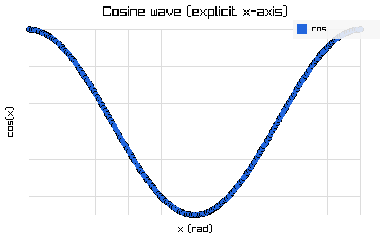

---

## Example 32 — Multiple bar series on one chart

Two `plot_add_bar` calls produce overlapping bar series with separate colors.

```c
#include "plot/plot.h"

int main(void) {
    Plot *p = plot_create("Monthly revenue by region", "Month", "Revenue ($K)");
    plot_set_size(p, 900, 550);

    float north[] = {120, 145, 160, 155, 180, 200};
    float south[] = { 90, 110, 130, 140, 150, 170};

    plot_add_bar(p, north, 6, "North", plot_color_hex(0x336699));
    plot_add_bar(p, south, 6, "South", plot_color_hex(0x99CC66));

    plot_export_image(p, "sources/ex32_multi_bar.png");
    plot_destroy(p);

    return 0;
}
```

**Result:**
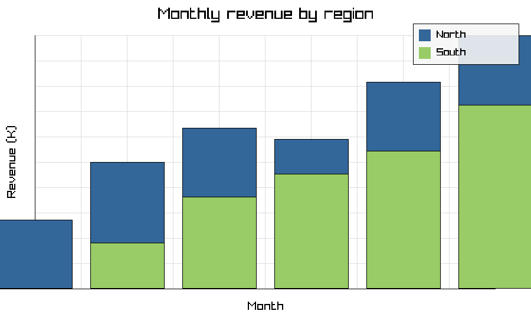

---

## Example 33 — Pie chart with six slices

One `PLTYPE_PIE` series per slice, each with its own color, produces a six-segment pie.

```c
#include "plot/plot.h"

int main(void) {
    Plot *p = plot_create("Browser market share 2025", "", "");
    plot_set_size(p, 700, 700);
    plot_set_legend(p, true);
    plot_set_grid(p, false);

    float chrome[]  = {65};  float safari[]  = {19};
    float edge[]    = { 4};  float firefox[] = { 3};
    float samsung[] = { 3};  float other[]   = { 6};

    plot_add_series(p, NULL, chrome,  1, "Chrome",  PLTYPE_PIE, plot_color_hex(0xFF6600));
    plot_add_series(p, NULL, safari,  1, "Safari",  PLTYPE_PIE, plot_color_hex(0x0066FF));
    plot_add_series(p, NULL, edge,    1, "Edge",    PLTYPE_PIE, plot_color_hex(0x33AACC));
    plot_add_series(p, NULL, firefox, 1, "Firefox", PLTYPE_PIE, plot_color_hex(0xFF4400));
    plot_add_series(p, NULL, samsung, 1, "Samsung", PLTYPE_PIE, plot_color_hex(0xCC44BB));
    plot_add_series(p, NULL, other,   1, "Other",   PLTYPE_PIE, plot_color_hex(0x888888));

    plot_export_image(p, "sources/ex33_pie6.png");
    plot_destroy(p);

    return 0;
}
```

**Result:**
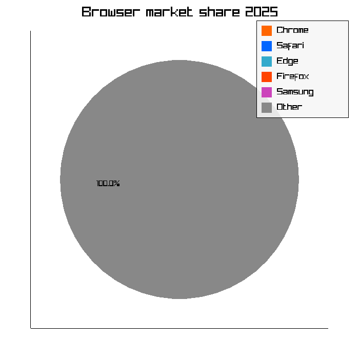

---

## Example 34 — Rainbow multi-line (four phase-shifted sine waves)

Four `plot_add_line` calls on a dark theme produce a rainbow of overlapping sinusoids.

```c
#include "plot/plot.h"
#include <math.h>

int main(void) {
    Plot *p = plot_create("Sine waves with phase shifts", "x", "amplitude");
    plot_set_size(p, 900, 500);
    plot_apply_theme_dark(p);

    float y[120];
    float         phases[] = {0.f,        0.5f,        1.0f,        1.5f};
    unsigned int  colors[] = {0xFF5555,   0xFFCC55,    0x55FF99,    0x5599FF};
    const char  *labels[] = {"phase=0", "phase=0.5", "phase=1.0", "phase=1.5"};

    for (int s = 0; s < 4; ++s) {
        for (int i = 0; i < 120; ++i) y[i] = sinf(i * 0.1f + phases[s]);
        plot_add_line(p, y, 120, labels[s], plot_color_hex(colors[s]));
    }

    plot_export_image(p, "sources/ex34_rainbow_lines.png");
    plot_destroy(p);

    return 0;
}
```

**Result:**
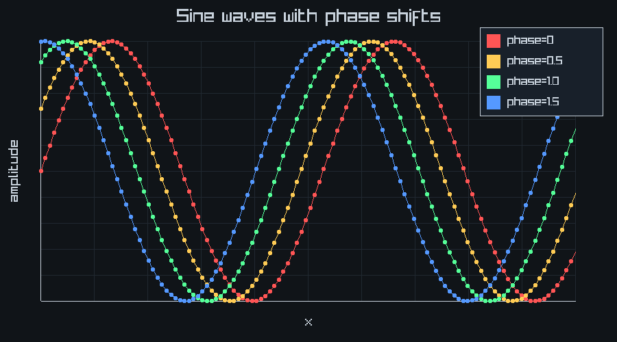

---

## Example 35 — Scatter plot with a linear trend overlay

Two `plot_add_scatter` calls: one for noisy data, one for the ideal `y = 2x` trend.

```c
#include "plot/plot.h"
#include <stdlib.h>

int main(void) {
    Plot *p = plot_create("Scatter with linear trend", "x", "y");
    plot_set_size(p, 800, 600);

    float xs[40], ys[40];
    srand(42);
    for (int i = 0; i < 40; ++i) {
        xs[i] = (float)i;
        ys[i] = 2.f * (float)i + (float)(rand() % 20) - 10.f;
    }
    plot_add_scatter(p, xs, ys, 40, "data",  plot_color_hex(0x6699CC));

    /* Perfect trend y = 2x (two endpoints) */
    float tx[2] = {0.f, 39.f}, ty[2] = {0.f, 78.f};
    plot_add_scatter(p, tx, ty, 2, "y=2x", plot_color_hex(0xFF4444));

    plot_export_image(p, "sources/ex35_scatter_trend.png");
    plot_destroy(p);

    return 0;
}
```

**Result:**
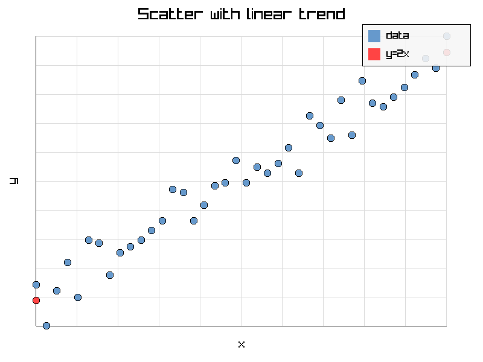

---

## Example 36 — Exponential growth bar chart

Bars for `2^n` (n = 0..9) demonstrate automatic y-range scaling on highly skewed data.

```c
#include "plot/plot.h"

int main(void) {
    Plot *p = plot_create("Exponential growth: 2^n", "n", "2^n");
    plot_set_size(p, 800, 500);

    float y[10];
    for (int i = 0; i < 10; ++i) y[i] = (float)(1 << i);
    plot_add_bar(p, y, 10, "2^n", plot_color_hex(0x44AACC));

    plot_export_image(p, "sources/ex36_exponential.png");
    plot_destroy(p);

    return 0;
}
```

**Result:**
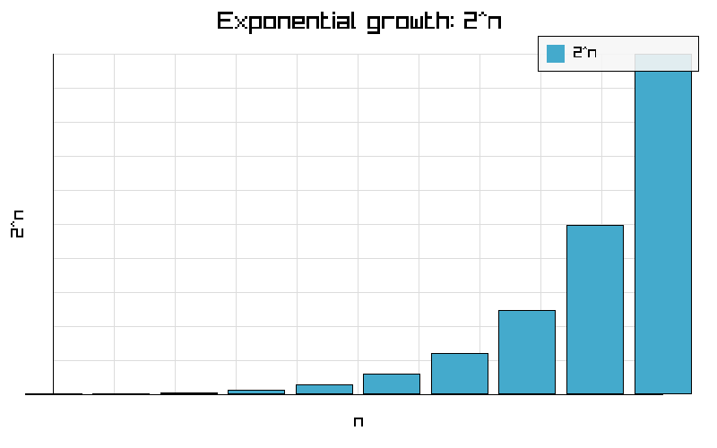

---

## Example 37 — Dark-themed scatter ("star field")

A scatter of 150 random points on a dark background illustrates the dark theme combined with `plot_add_scatter`.

```c
#include "plot/plot.h"
#include <stdlib.h>

int main(void) {
    Plot *p = plot_create("Star field (dark scatter)", "x", "y");
    plot_set_size(p, 800, 600);
    plot_apply_theme_dark(p);

    float x[150], y[150];
    srand(123);
    for (int i = 0; i < 150; ++i) {
        x[i] = (float)(rand() % 100);
        y[i] = (float)(rand() % 100);
    }
    plot_add_scatter(p, x, y, 150, "stars", plot_color_hex(0xFFFFAA));

    plot_export_image(p, "sources/ex37_dark_scatter.png");
    plot_destroy(p);

    return 0;
}
```

**Result:**
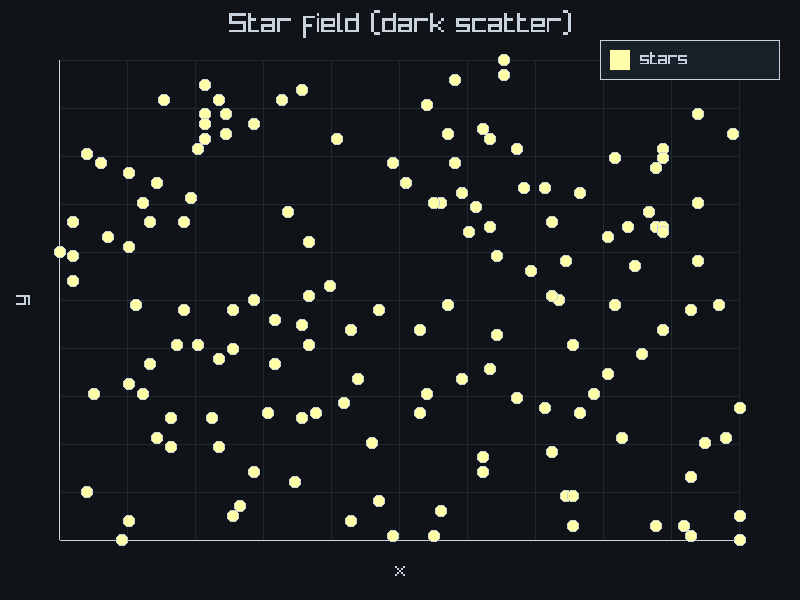

---

## Example 38 — Gaussian histogram from 1 000 samples

The central-limit sum of six uniforms approximates a bell curve; the histogram renderer bins the samples automatically.

```c
#include "plot/plot.h"
#include <stdlib.h>

int main(void) {
    Plot *p = plot_create("Gaussian histogram (1000 samples)", "value", "count");
    plot_set_size(p, 800, 500);

    float data[1000];
    srand(99);
    for (int i = 0; i < 1000; ++i) {
        float s = 0;
        for (int k = 0; k < 6; ++k) s += (float)(rand() % 100);
        data[i] = s / 6.f;
    }
    plot_add_series(p, NULL, data, 1000, "samples", PLTYPE_HISTOGRAM, plot_color_hex(0x6644AA));

    plot_export_image(p, "sources/ex38_histogram.png");
    plot_destroy(p);

    return 0;
}
```

**Result:**
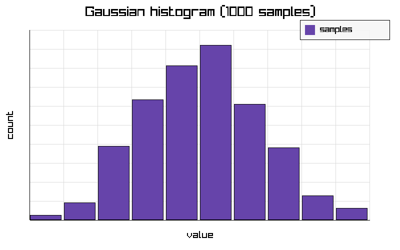

---

## Example 39 — Visualize per-series statistics as a bar chart

Use `plot_series_min`, `plot_series_max`, `plot_series_sum`, and `plot_series_mean` to compute descriptive stats, then plot them.

```c
#include "plot/plot.h"

int main(void) {
    /* Step 1: compute statistics from source data. */
    Plot *src = plot_create("source", "x", "y");
    float raw[] = {12, 45, 23, 67, 34, 89, 56, 78, 11, 90};
    plot_add_line(src, raw, 10, "raw", plot_color_hex(0));

    float mn, mx, sm, mu;
    plot_series_min (src, 0, &mn);
    plot_series_max (src, 0, &mx);
    plot_series_sum (src, 0, &sm);
    plot_series_mean(src, 0, &mu);
    plot_destroy(src);

    /* Step 2: display those four stats as bars. */
    Plot *p = plot_create("Series statistics overview", "stat", "value");
    plot_set_size(p, 700, 500);
    float stats[] = {mn, mx, sm / 10.f, mu};   /* sum/10 for visual scale */
    plot_add_bar(p, stats, 4, "min/max/sum10/mean", plot_color_hex(0xCC6633));

    plot_export_image(p, "sources/ex39_stats_bar.png");
    plot_destroy(p);
    return 0;
}
```

**Result:**
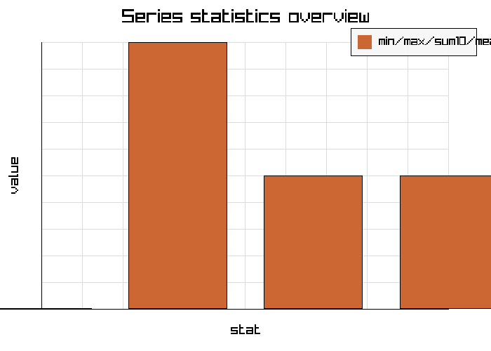

---

## Example 40 — Dark-themed latency dashboard with CSV export

Combines `plot_apply_theme_dark`, `plot_linspace`, three line series, `plot_export_image`, and `plot_export_csv` in one program.

```c
#include "plot/plot.h"
#include <math.h>

int main(void) {
    Plot *p = plot_create("API latency percentiles", "second", "ms");
    plot_set_size(p, 1024, 600);
    plot_apply_theme_dark(p);

    float x[80], p50[80], p95[80], p99[80];
    plot_linspace(0.f, 8.f, 80, x);
    for (int i = 0; i < 80; ++i) {
        float t = x[i];
        p50[i] = 18.f + 3.f  * sinf(t * 1.2f);
        p95[i] = 45.f + 7.f  * sinf(t * 0.9f + 0.3f);
        p99[i] = 80.f + 12.f * sinf(t * 0.6f + 0.6f);
    }

    plot_add_line(p, p50, 80, "p50", plot_color_hex(0x44DD88));
    plot_add_line(p, p95, 80, "p95", plot_color_hex(0xFFCC44));
    plot_add_line(p, p99, 80, "p99", plot_color_hex(0xFF4455));

    plot_export_image(p, "sources/ex40_dashboard.png");
    plot_export_csv  (p, "sources/ex40_dashboard.csv");
    plot_destroy(p);

    return 0;
}
```

**Result:**
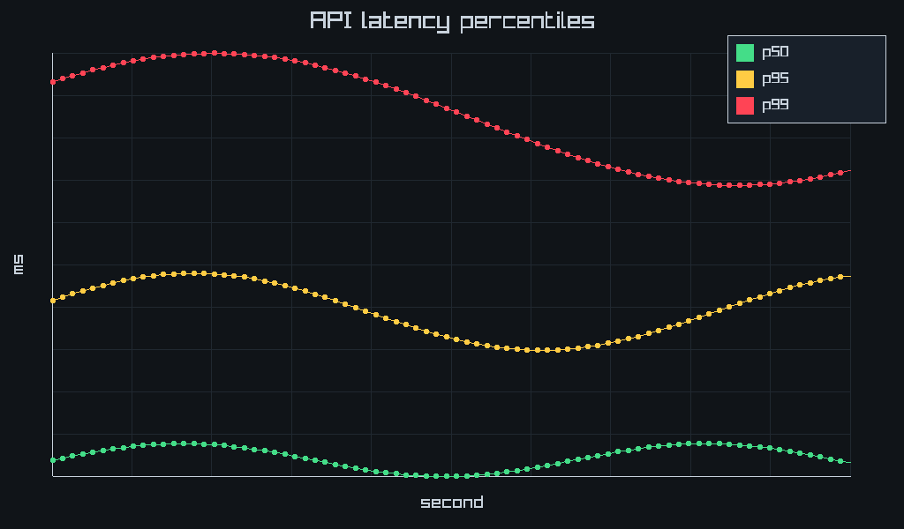

---

## Example 41 — Histogram with a custom title font (`plot_set_font_size`, `plot_add_histogram`, `plot_get_size`, `plot_series_stddev`)

```c
#include "plot/plot.h"
#include "fmt/fmt.h"

int main(void) {
    Plot* p = plot_create("Sample Distribution", "value", "count");
    plot_set_size(p, 800, 500);
    plot_set_font_size(p, 36, 22);           /* bigger title + axis labels */

    float samples[] = {2,3,3,4,4,4,5,5,5,5,6,6,6,7,7,8,4,5,6,5};
    plot_add_histogram(p, samples, 20, "samples", plot_color_hex(0x3366CC));

    float sd = 0.0f;
    plot_series_stddev(p, 0, &sd);
    int w = 0, h = 0;
    plot_get_size(p, &w, &h);
    fmt_printf("canvas %dx%d, stddev=%.3f\n", w, h, sd);

    plot_export_image(p, "sources/ex41_histogram.png");
    plot_destroy(p);
    return 0;
}
```

**Output**
```
canvas 800x500, stddev=1.449
```

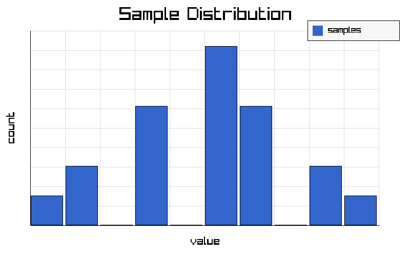

---

## Example 42 — Pin an axis range for a fixed-scale dashboard (`plot_set_ylim`, `plot_get_ylim`, `plot_autoscale`)

By default each axis auto-scales to whatever data is present, so two snapshots of the same metric can end up on different scales. Pinning the y-axis to a fixed `0..100%` makes every render directly comparable. `plot_get_ylim` reports the effective range without needing a graphics context, and `plot_autoscale` restores auto-ranging.

```c
#include "plot/plot.h"
#include "fmt/fmt.h"

int main(void) {
    Plot* p = plot_create("CPU load", "sample", "percent");
    plot_set_size(p, 640, 400);

    /* Readings that swing between 5% and 95%. */
    float load[8] = {5, 40, 95, 60, 30, 80, 12, 70};
    plot_add_line(p, load, 8, "cpu", plot_color_hex(0x2266DD));

    /* By default the y-axis auto-scales to the data. */
    float lo = 0, hi = 0;
    plot_get_ylim(p, &lo, &hi);
    fmt_printf("auto    y-range: [%.1f, %.1f]\n", lo, hi);

    /* Pin it to a fixed 0..100% so every snapshot shares one scale. */
    plot_set_ylim(p, 0.0f, 100.0f);
    plot_get_ylim(p, &lo, &hi);
    fmt_printf("pinned  y-range: [%.1f, %.1f]\n", lo, hi);

    /* The pinned range is honored by the renderer. */
    bool ok = plot_export_image(p, "cpu_load.png");
    fmt_printf("exported cpu_load.png: %s\n", ok ? "ok" : "failed");

    /* Revert to auto-scaling. */
    plot_autoscale(p);
    plot_get_ylim(p, &lo, &hi);
    fmt_printf("after autoscale: [%.1f, %.1f]\n", lo, hi);

    plot_destroy(p);
    return 0;
}
```

**Result**
```
auto    y-range: [5.0, 95.0]
pinned  y-range: [0.0, 100.0]
exported cpu_load.png: ok
after autoscale: [5.0, 95.0]
```

---

## License

This project is open-source and available under the ISC License.
