## Turtle Graphics Library in C

**Author:** Amin Tahmasebi  
**Release Date:** 2024  
**License:** ISC License

## Overview

The Turtle Graphics library in C provides functions for drawing shapes and lines using a "turtle" that moves around the screen. Inspired by the Python `turtle` module, this library allows C developers to easily create graphics and animations.

## Key Features

- **Turtle Movement:** Functions to move the turtle forward and turn it to different angles.
- **Drawing Control:** Functions to lift and lower the pen, control the drawing color, and set the turtle's speed.
- **Window Management:** Functions to initialize the drawing window, set the frame rate, and clear the background.
- **User-Defined Drawing Functions:** Support for user-defined drawing functions to be executed within the main drawing loop.
- **Documentation:** Fully documented with Doxygen format for easy integration and usage.

## Installation and Compilation

To use this library, you need to have the `raylib` library installed. Follow the instructions below for your operating system:

#### Linux

1. **Clone the raylib repository and build it from source:**

    ```bash
    git clone https://github.com/raysan5/raylib.git
    cd raylib/src
    make PLATFORM=PLATFORM_DESKTOP
    sudo make install
    ```

2. **Install additional required packages:**

    ```bash
    sudo apt-get install libx11-dev libxcursor-dev libxrandr-dev libxinerama-dev libxi-dev libgl1-mesa-dev
    ```

3. **Rebuild raylib with `-fPIC`:**

   To ensure `raylib` is compiled with position-independent code, follow these steps:

   ```bash
   mkdir build
   cd ~/Desktop/raylib/build
   make clean
   cmake .. -DCMAKE_C_FLAGS="-fPIC" -DCMAKE_BUILD_TYPE=Release
   make
   sudo make install
   ```

#### Windows

For Windows, it is recommended to use MSYS2 to install `raylib`. First, download and install MSYS2 from [msys2.org](https://www.msys2.org/). Then, open the MSYS2 terminal and run the following commands:

```bash
pacman -Syu
pacman -S mingw-w64-x86_64-raylib
```

### Compiling the Turtle Graphics Library

To use this library, include `turtle.h` in your project and compile the source files with your C compiler. For GCC, the following command can be used:

```bash
gcc -std=c17 -O3 -march=native -flto -funroll-loops -Wall -Wextra -pedantic -s -o main ./main.c ./turtle/turtle.c -lraylib -lm
```

### Rebuilding the Project

After `raylib` has been successfully recompiled and installed, go back to your `c_std` project directory and clean the build files:

```bash
cd ~/Desktop/c_std/build
rm -rf CMakeCache.txt CMakeFiles/ build/
cmake -G "Unix Makefiles" -DCMAKE_C_COMPILER=gcc -DCMAKE_CXX_COMPILER=g++ ..
cmake --build .
```

## Documentation

The documentation includes detailed descriptions of all the functions provided by the library, along with usage examples. It covers basic operations like moving the turtle and drawing shapes.

### Function Descriptions


### `Turtle *turtle_create(void)`

**Purpose**:  
This function creates and initializes a new `Turtle` instance. It sets up various turtle attributes like position, heading, pen color, and line drawing structures. This function also allocates memory for storing lines, stamps, and fill points, which are necessary for turtle drawing.

**Parameters**:  
None.

**Return Value**:  
- A pointer to the newly created `Turtle` structure.
- If memory allocation fails, the program exits with an error.

**Usage Case**:  
Use this function when starting a new turtle drawing session to initialize the turtle's state and prepare it for drawing.

---

### `void turtle_deallocate(Turtle *state)`

**Purpose**:  
Deallocates and cleans up all memory associated with the `Turtle` instance. This includes freeing the memory for the turtle itself, the lines it has drawn, stamps, and any points used for filling shapes.

**Parameters**:  
- `state`: A pointer to the `Turtle` structure that needs to be deallocated.

**Return Value**:  
This function does not return any value.

**Usage Case**:  
Call this function when you are done with the turtle to free up memory and avoid memory leaks.

---

### `void turtle_close_window(void)`

**Purpose**:  
Closes the window used for rendering turtle graphics. This function should be called when the drawing session is over and the window is no longer needed.

**Parameters**:  
None.

**Return Value**:  
This function does not return any value.

**Usage Case**:  
Use this function to close the window after completing the turtle drawing, typically at the end of a program or session.

---

### `void turtle_init_window(int width, int height, const char *title)`

**Purpose**:  
Initializes a window with the specified width, height, and title for turtle graphics rendering. This window is where all turtle-related drawings will appear.

**Parameters**:  
- `width`: The width of the window in pixels.
- `height`: The height of the window in pixels.
- `title`: The title of the window that will appear in the title bar.

**Return Value**:  
This function does not return any value.

**Usage Case**:  
Call this function at the start of your turtle graphics session to create a window where drawings can be rendered.

---

### `void turtle_set_fps(int fps)`

**Purpose**:  
Sets the target frames per second (FPS) for the turtle window, controlling how often the window refreshes and how smoothly graphics are rendered.

**Parameters**:  
- `fps`: The desired frames per second value.

**Return Value**:  
This function does not return any value.

**Usage Case**:  
Use this function to adjust the speed of rendering in your turtle window. A higher FPS will result in smoother animations, while a lower FPS will slow down the rendering process.

--- 

### `void turtle_set_speed(Turtle *state, float speed)`

**Purpose**:  
This function adjusts the movement speed of the turtle. It also recalculates the step size that determines how far the turtle moves per frame based on the given speed.

**Parameters**:  
- `state`: A pointer to the `Turtle` structure whose speed is being set.
- `speed`: The desired speed for the turtle as a floating-point value.

**Return Value**:  
None.

**Usage Case**:  
Use this function to increase or decrease the turtle's movement speed, which directly affects how fast it draws on the screen.

---

### `void turtle_pen_size(Turtle *state, float width)`

**Purpose**:  
This function sets the thickness of the pen that the turtle uses to draw lines. The thicker the pen, the wider the lines it draws.

**Parameters**:  
- `state`: A pointer to the `Turtle` structure whose pen size is being set.
- `width`: The desired thickness of the pen as a floating-point value.

**Return Value**:  
None.

**Usage Case**:  
Use this function to change the thickness of the lines drawn by the turtle. For example, setting a thicker pen size is useful for bold or emphasized drawings.

---

### `float turtle_get_pen_size(Turtle *state)`

**Purpose**:  
This function retrieves the current thickness (width) of the turtle's pen.

**Parameters**:  
- `state`: A pointer to the `Turtle` structure from which to retrieve the pen size.

**Return Value**:  
The current pen thickness as a floating-point value.

**Usage Case**:  
Use this function when you need to know the current pen size, for example, to display it or adjust the drawing style based on it.

---

### `bool turtle_is_down(Turtle *state)`

**Purpose**:  
This function checks if the turtle's pen is currently down (meaning it is in drawing mode) or up (meaning it is moving without drawing).

**Parameters**:  
- `state`: A pointer to the `Turtle` structure whose pen state is being checked.

**Return Value**:  
- `true`: If the pen is down.
- `false`: If the pen is up.

**Usage Case**:  
Use this function to determine if the turtle is actively drawing on the screen, which can help in making decisions about when to draw lines.

---

### `void turtle_forward(Turtle *state, float distance)`

**Purpose**:  
This function moves the turtle forward by a specified distance. If the pen is down, it draws a line along the turtle's path. The movement is broken into smaller steps for smooth transitions, and if the turtle is in fill mode, points are added to the fill buffer.

**Parameters**:  
- `state`: A pointer to the `Turtle` structure representing the turtle's state.
- `distance`: The distance (in units) to move the turtle forward.

**Return Value**:  
None.

**Usage Case**:  
Use this function to move the turtle forward by a specified amount, either drawing a line or moving without drawing, depending on the pen state.

---

### `void turtle_position(Turtle *state, float *x, float *y)`

**Purpose**:  
This function retrieves the current x and y coordinates of the turtle's position.

**Parameters**:  
- `state`: A pointer to the `Turtle` structure.
- `x`: A pointer to store the x-coordinate of the turtle's position.
- `y`: A pointer to store the y-coordinate of the turtle's position.

**Return Value**:  
None.

**Usage Case**:  
Use this function to get the current position of the turtle in the graphical window.

---

### `void turtle_turn(Turtle *state, float angle)`

**Purpose**:  
This function adjusts the turtle's heading by a specified angle in degrees.

**Parameters**:  
- `state`: A pointer to the `Turtle` structure.
- `angle`: The angle (in degrees) to turn the turtle.

**Return Value**:  
None.

**Usage Case**:  
Use this function to turn the turtle by a specified number of degrees, changing its heading without affecting its position.

---

### `void turtle_right(Turtle *state, float angle)`

**Purpose**:  
This function turns the turtle to the right (clockwise) by decreasing the turtle's heading by a specified angle.

**Parameters**:  
- `state`: A pointer to the `Turtle` structure.
- `angle`: The angle (in degrees) to turn the turtle to the right.

**Return Value**:  
None.

**Usage Case**:  
Use this function to turn the turtle right, making the turtle face a new direction without moving its position.

---

### `void turtle_left(Turtle *state, float angle)`

**Purpose**:  
This function turns the turtle to the left (counterclockwise) by increasing the turtle's heading by a specified angle.

**Parameters**:  
- `state`: A pointer to the `Turtle` structure.
- `angle`: The angle (in degrees) to turn the turtle to the left.

**Return Value**:  
None.

**Usage Case**:  
Use this function to turn the turtle left, changing its direction without affecting its current position.

---

### `void turtle_pen_up(Turtle *state)`

**Purpose**:  
This function lifts the turtle's pen, preventing it from drawing lines while it moves.

**Parameters**:  
- `state`: A pointer to the `Turtle` structure.

**Return Value**:  
None.

**Usage Case**:  
Use this function when you want to move the turtle without drawing a line.

---

### `void turtle_pen_down(Turtle *state)`

**Purpose**:  
This function lowers the turtle's pen, allowing it to draw lines as it moves. When the pen is down, any movement by the turtle will leave a trail (line).

**Parameters**:  
- `state`: A pointer to the `Turtle` structure.

**Return Value**:  
None.

**Usage Case**:  
Use this function when you want the turtle to start drawing as it moves.

---

### `void turtle_set_color(Turtle *state, unsigned char r, unsigned char g, unsigned char b, unsigned char a)`

**Purpose**:  
This function sets the turtle's pen color using specified RGBA values. The color will be used to draw lines as the turtle moves with the pen down.

**Parameters**:  
- `state`: A pointer to the `Turtle` structure.
- `r`: Red component of the color (0-255).
- `g`: Green component of the color (0-255).
- `b`: Blue component of the color (0-255).
- `a`: Alpha (transparency) component of the color (0-255).

**Return Value**:  
None.

**Usage Case**:  
Use this function to set the pen color of the turtle with specific RGBA values, allowing control over the transparency of the drawing.

---

### `void turtle_color(Turtle *state, const char *pencolor_str, const char *fillcolor_str)`

**Purpose**:  
This function sets both the pen and fill colors for the turtle using hexadecimal color strings. The pen color is used for drawing lines, while the fill color is used during fill operations.

**Parameters**:  
- `state`: A pointer to the `Turtle` structure.
- `pencolor_str`: Hexadecimal string representing the pen color (e.g., "#FF0000" for red).
- `fillcolor_str`: Hexadecimal string representing the fill color.

**Return Value**:  
None.

**Usage Case**:  
Use this function to set the pen and fill colors using hex codes, which are commonly used in web and graphics programming.

---

### `void turtle_color_rgb(Turtle *state, unsigned char pr, unsigned char pg, unsigned char pb, unsigned char fr, unsigned char fg, unsigned char fb)`

**Purpose**:  
This function sets the pen color and fill color for the turtle using RGB values. The pen color is used for drawing lines, and the fill color is used for filling shapes.

**Parameters**:  
- `state`: A pointer to the `Turtle` structure.
- `pr`: Red component for the pen color (0-255).
- `pg`: Green component for the pen color (0-255).
- `pb`: Blue component for the pen color (0-255).
- `fr`: Red component for the fill color (0-255).
- `fg`: Green component for the fill color (0-255).
- `fb`: Blue component for the fill color (0-255).

**Return Value**:  
None.

**Usage Case**:  
Use this function to set both pen and fill colors for the turtle using RGB values, providing full control over the drawing and filling colors.

---

### `bool turtle_filling(Turtle *state)`

**Purpose**:  
This function checks if the turtle is currently in fill mode. When in fill mode, the turtle collects points for creating a filled shape.

**Parameters**:  
- `state`: A pointer to the `Turtle` structure.

**Return Value**:  
- `true` if the turtle is filling, `false` otherwise.

**Usage Case**:  
Use this function to check whether the turtle is currently in fill mode, indicating whether the turtle will fill a shape.

---

### `void turtle_begin_fill(Turtle *state)`

**Purpose**:  
This function starts the fill operation for the turtle. It enables the turtle's filling mode and begins tracking points for the filled shape.

**Parameters**:  
- `state`: A pointer to the `Turtle` structure.

**Return Value**:  
None.

**Usage Case**:  
Use this function when you want the turtle to begin collecting points for creating a filled shape.

---

### `void turtle_end_fill(Turtle *state)`

**Purpose**:  
This function ends the fill operation and draws the filled shape using the points collected during the fill process. The shape is drawn using the turtle's current fill color.

**Parameters**:  
- `state`: A pointer to the `Turtle` structure.

**Return Value**:  
None.

**Usage Case**:  
Use this function to complete a fill operation and render the filled shape.

---

### `void turtle_draw(Turtle *state)`

**Purpose**:  
This function renders the current state of the turtle, including the lines it has drawn, any filled shapes, stamps, and the turtle itself. It clears the background before drawing the updated scene.

**Parameters**:  
- `state`: A pointer to the `Turtle` structure.

**Return Value**:  
None.

**Usage Case**:  
Use this function to render everything the turtle has drawn in the window, ensuring that all visual elements (lines, stamps, turtle, etc.) are updated.

---

### `void turtle_begin_drawing(void)`

**Purpose**:  
This function begins a drawing operation, preparing the canvas for rendering shapes, lines, or any other drawing instructions.

**Parameters**:  
None.

**Return Value**:  
None.

**Usage Case**:  
Use this function at the beginning of any drawing process, before rendering anything on the screen.

---

### `void turtle_clear_background(Color color)`

**Purpose**:  
This function clears the screen by filling the background with the specified color.

**Parameters**:  
- `color`: A `Color` structure specifying the RGBA values to fill the background.

**Return Value**:  
None.

**Usage Case**:  
Use this function to clear the screen before drawing anything new, ensuring that previous frames are erased.

---

### `void turtle_end_drawing(void)`

**Purpose**:  
This function concludes the current drawing operation, finalizing the rendering process.

**Parameters**:  
None.

**Return Value**:  
None.

**Usage Case**:  
Use this function to finalize the drawing operation, after all rendering instructions have been issued.

---

### `void turtle_done(Turtle *state, TurtleDrawFunc user_draw)`

**Purpose**:  
This function runs the main drawing loop for the turtle graphics, rendering the turtle and its drawings repeatedly until the window is closed. It also calls a user-provided drawing function (`user_draw`), allowing custom drawings to be added.

**Parameters**:  
- `state`: A pointer to the `Turtle` structure representing the turtle's current state.
- `user_draw`: A function pointer to a user-defined drawing function that takes a `Turtle` pointer as a parameter.

**Return Value**:  
None.

**Usage Case**:  
Use this function to handle the continuous drawing loop for turtle graphics. You can also pass a custom function to render additional shapes or drawings as needed.

---

### `void turtle_set_position(Turtle *state, float x, float y)`

**Purpose**:  
This function moves the turtle to the specified `(x, y)` coordinates. If the pen is down, a line is drawn from the current position to the new position. If the turtle is in fill mode, the new position is added to the fill points for future shape filling.

**Parameters**:  
- `state`: A pointer to the `Turtle` structure representing the turtle's current state.
- `x`: The new X-coordinate for the turtle's position.
- `y`: The new Y-coordinate for the turtle's position.

**Return Value**:  
None.

**Usage Case**:  
Use this function when you need to move the turtle to a specific position on the screen. The turtle will draw a line if its pen is down.

---

### `void turtle_set_x(Turtle *state, float x)`

**Purpose**:  
This function moves the turtle to the specified X-coordinate, keeping the Y-coordinate unchanged. If the pen is down, a line is drawn from the current position to the new X-coordinate. If the turtle is in fill mode, the new position is added to the fill points.

**Parameters**:  
- `state`: A pointer to the `Turtle` structure representing the turtle's current state.
- `x`: The new X-coordinate for the turtle's position.

**Return Value**:  
None.

**Usage Case**:  
Use this function when you only want to adjust the X-coordinate of the turtle without changing its Y-coordinate.

---

### `void turtle_set_y(Turtle *state, float y)`

**Purpose**:  
This function moves the turtle to the specified Y-coordinate, keeping the X-coordinate unchanged. If the pen is down, a line is drawn from the current position to the new Y-coordinate. If the turtle is in fill mode, the new position is added to the fill points.

**Parameters**:  
- `state`: A pointer to the `Turtle` structure representing the turtle's current state.
- `y`: The new Y-coordinate for the turtle's position.

**Return Value**:  
None.

**Usage Case**:  
Use this function when you want to adjust the Y-coordinate of the turtle while keeping its X-coordinate unchanged.

---

### `void turtle_set_heading(Turtle *state, float to_angle)`

**Purpose**:  
This function sets the turtle's heading (direction) to a specific angle, in degrees.

**Parameters**:  
- `state`: A pointer to the `Turtle` structure representing the turtle's current state.
- `to_angle`: The desired heading angle in degrees.

**Return Value**:  
None.

**Usage Case**:  
Use this function to change the turtle's direction to a specific angle.

---

### `void turtle_home(Turtle *state)`

**Purpose**:  
This function moves the turtle back to the home position `(0, 0)` and resets its heading to 0 degrees. If the pen is down, a line is drawn from the turtle's current position to the home position.

**Parameters**:  
- `state`: A pointer to the `Turtle` structure representing the turtle's current state.

**Return Value**:  
None.

**Usage Case**:  
Use this function to bring the turtle back to its starting position at the center of the screen and reset its heading direction.

---

### `void turtle_circle(Turtle *state, float radius, float extent, int steps)`

**Purpose**:  
This function draws a circle or an arc with the specified radius, extent (arc angle), and number of steps (resolution). If the number of steps is not provided, it is automatically calculated based on the radius.

**Parameters**:  
- `state`: A pointer to the `Turtle` structure representing the turtle's current state.
- `radius`: The radius of the circle.
- `extent`: The angular extent of the circle or arc in degrees (default is 360 for a full circle).
- `steps`: The number of steps to divide the circle into. If set to 0, it is automatically calculated.

**Return Value**:  
None.

**Usage Case**:  
Use this function to draw a full circle or an arc. The number of steps controls how smooth the circle or arc looks. You can also specify how much of the circle to draw using the `extent` parameter.

---

### `void turtle_dot(Turtle *state, float size, unsigned char r, unsigned char g, unsigned char b, unsigned char a)`

**Purpose**:  
This function draws a dot of the specified size and color at the turtle's current position.

**Parameters**:  
- `state`: A pointer to the `Turtle` structure representing the turtle's current state.
- `size`: The size of the dot to be drawn.
- `r`: The red component of the dot's color (0-255).
- `g`: The green component of the dot's color (0-255).
- `b`: The blue component of the dot's color (0-255).
- `a`: The alpha (transparency) component of the dot's color (0-255).

**Return Value**:  
None.

**Usage Case**:  
Use this function when you want the turtle to draw a circular dot at its current location.

---

### `int turtle_stamp(Turtle *state)`

**Purpose**:  
This function stamps the turtle's current position and pencolor onto the screen. Each stamp is assigned a unique ID, allowing it to be cleared later.

**Parameters**:  
- `state`: A pointer to the `Turtle` structure representing the turtle's current state.

**Return Value**:  
Returns the unique ID of the created stamp.

**Usage Case**:  
Use this function when you want to mark the turtle's current location and pencolor without moving the turtle.

---

### `void turtle_clear_stamp(Turtle *state, int stamp_id)`

**Purpose**:  
This function clears a previously created stamp by its ID, removing it from the screen.

**Parameters**:  
- `state`: A pointer to the `Turtle` structure.
- `stamp_id`: The unique ID of the stamp to be cleared.

**Return Value**:  
None.

**Usage Case**:  
Use this function to remove a specific stamp from the screen based on its unique ID.

---

### `float turtle_distance(Turtle *state, float x, float y)`

**Purpose**:  
This function calculates and returns the Euclidean distance between the turtle's current position and a specified point.

**Parameters**:  
- `state`: A pointer to the `Turtle` structure representing the turtle's current state.
- `x`: The X-coordinate of the point to calculate the distance to.
- `y`: The Y-coordinate of the point to calculate the distance to.

**Return Value**:  
Returns the distance between the turtle's current position and the specified point.

**Usage Case**:  
Use this function when you need to determine how far the turtle is from a particular point on the screen.

---

### `float turtle_distance_turtle(Turtle *state, Tu *other_turtle)`

**Purpose**:  
This function calculates and returns the Euclidean distance between two turtles.

**Parameters**:  
- `state`: A pointer to the `Turtle` structure representing the current turtle.
- `other_turtle`: A pointer to another turtle whose distance from the current turtle is to be calculated.

**Return Value**:  
Returns the distance between the two turtles.

**Usage Case**:  
Use this function to calculate how far apart two turtles are from each other.

---

### `void turtle_degrees(Turtle *state, float fullcircle)`

**Purpose**:  
This function sets the turtle's movement mode to use degrees, with the specified number of degrees representing a full circle (typically 360 degrees).

**Parameters**:  
- `state`: A pointer to the `Turtle` structure.
- `fullcircle`: The number of degrees that make up a full circle (e.g., 360 for degrees, or other custom values).

**Return Value**:  
None.

**Usage Case**:  
Use this function to configure the turtle to work with degrees for its angular movements.

---

### `void turtle_radians(Turtle *state)`

**Purpose**:  
This function switches the turtle's angular movement to use radians, with `2 * PI` radians representing a full circle.

**Parameters**:  
- `state`: A pointer to the `Turtle` structure.

**Return Value**:  
None.

**Usage Case**:  
Use this function to switch the turtle to use radians for angular movements, instead of degrees.

--- 

### `float turtle_heading(Turtle *state)`

**Purpose**:  
This function retrieves the turtle's current heading in degrees, normalized to the full circle degrees (default is 360).

**Parameters**:  
- `state`: A pointer to the `Turtle` structure representing the turtle's current state.

**Return Value**:  
Returns the turtle's current heading in degrees, adjusted for the full circle setting.

**Usage Case**:  
Use this function when you need to know the direction the turtle is currently facing in degrees, particularly when using degrees for movement.

---

### `void turtle_set_background_color(Turtle *state, unsigned char r, unsigned char g, unsigned char b, unsigned char a)`

**Purpose**:  
This function sets the background color of the drawing window to the specified RGBA values, allowing you to customize the background appearance.

**Parameters**:  
- `state`: A pointer to the `Turtle` structure.
- `r`: The red component of the background color (0-255).
- `g`: The green component of the background color (0-255).
- `b`: The blue component of the background color (0-255).
- `a`: The alpha (transparency) component of the background color (0-255).

**Return Value**:  
None.

**Usage Case**:  
Use this function to change the background color of the turtle's drawing area, making it suitable for different visual designs.


### `void turtle_backward(Turtle *state, float distance)`

**Purpose**:  
Moves the turtle in the opposite of its current heading by the specified distance. This is a thin wrapper around `turtle_forward(state, -distance)`.

**Parameters**:  
- `state`: A pointer to the `Turtle` structure representing the turtle's current state.
- `distance`: The distance (in units) to move the turtle backward.

**Return Value**:  
None.

**Usage Case**:  
Use this function when you want to reverse the turtle's direction of movement without changing its heading angle.

---

### `float turtle_get_x(const Turtle *state)`

**Purpose**:  
Returns the turtle's current X-coordinate in O(1) time.

**Parameters**:  
- `state`: A pointer to the `Turtle` structure. May be `NULL` (returns `0.0f`).

**Return Value**:  
The current X-coordinate as a `float`, or `0.0f` if `state` is `NULL`.

**Usage Case**:  
Use this function to read the turtle's horizontal position without modifying it.

---

### `float turtle_get_y(const Turtle *state)`

**Purpose**:  
Returns the turtle's current Y-coordinate in O(1) time.

**Parameters**:  
- `state`: A pointer to the `Turtle` structure. May be `NULL` (returns `0.0f`).

**Return Value**:  
The current Y-coordinate as a `float`, or `0.0f` if `state` is `NULL`.

**Usage Case**:  
Use this function to read the turtle's vertical position without modifying it.

---

### `float turtle_get_speed(const Turtle *state)`

**Purpose**:  
Returns the turtle's current movement speed as last set by `turtle_set_speed`.

**Parameters**:  
- `state`: A pointer to the `Turtle` structure. May be `NULL` (returns `0.0f`).

**Return Value**:  
The current speed value as a `float`, or `0.0f` if `state` is `NULL`.

**Usage Case**:  
Use this function to inspect the turtle's speed, for example when saving and restoring state.

---

### `void turtle_get_pen_color(const Turtle *state, unsigned char *r, unsigned char *g, unsigned char *b, unsigned char *a)`

**Purpose**:  
Reads back the turtle's current pen color into the provided RGBA out-pointers.

**Parameters**:  
- `state`: A pointer to the `Turtle` structure. May be `NULL` (all outputs set to 0).
- `r`: Destination for the red channel. Pass `NULL` to skip.
- `g`: Destination for the green channel. Pass `NULL` to skip.
- `b`: Destination for the blue channel. Pass `NULL` to skip.
- `a`: Destination for the alpha channel. Pass `NULL` to skip.

**Return Value**:  
None.

**Usage Case**:  
Use this function to inspect or save the pen color without modifying it, for example to restore it after a temporary color change.

---

### `void turtle_get_fill_color(const Turtle *state, unsigned char *r, unsigned char *g, unsigned char *b, unsigned char *a)`

**Purpose**:  
Reads back the turtle's current fill color into the provided RGBA out-pointers.

**Parameters**:  
- `state`: A pointer to the `Turtle` structure. May be `NULL` (all outputs set to 0).
- `r`: Destination for the red channel. Pass `NULL` to skip.
- `g`: Destination for the green channel. Pass `NULL` to skip.
- `b`: Destination for the blue channel. Pass `NULL` to skip.
- `a`: Destination for the alpha channel. Pass `NULL` to skip.

**Return Value**:  
None.

**Usage Case**:  
Use this function to inspect the fill color currently used by `turtle_begin_fill` / `turtle_end_fill`, for example before overriding it temporarily.

---

### `void turtle_get_background_color(const Turtle *state, unsigned char *r, unsigned char *g, unsigned char *b, unsigned char *a)`

**Purpose**:  
Reads back the drawing window's current background color into the provided RGBA out-pointers.

**Parameters**:  
- `state`: A pointer to the `Turtle` structure. May be `NULL` (all outputs set to 0).
- `r`: Destination for the red channel. Pass `NULL` to skip.
- `g`: Destination for the green channel. Pass `NULL` to skip.
- `b`: Destination for the blue channel. Pass `NULL` to skip.
- `a`: Destination for the alpha channel. Pass `NULL` to skip.

**Return Value**:  
None.

**Usage Case**:  
Use this function to read the background color before changing it, allowing it to be restored later.

---

### `void turtle_reset(Turtle *state)`

**Purpose**:  
Resets the turtle to its initial state: clears every drawn line, stamp, and fill point, and restores the turtle's position, heading, pen state, colors, and speed to their defaults. Buffer capacities are preserved so subsequent draws do not trigger immediate reallocation.

**Parameters**:  
- `state`: A pointer to the `Turtle` structure to reset.

**Return Value**:  
None.

**Usage Case**:  
Use this function to restart a drawing session from scratch without reallocating memory, for example at the beginning of a new animation frame or when replaying a sequence.

---

### `void turtle_clear(Turtle *state)`

**Purpose**:  
Clears every drawn line, stamp, and fill point from the buffer, but leaves the turtle exactly where it is with its current heading, colors, and pen state intact.

**Parameters**:  
- `state`: A pointer to the `Turtle` structure to clear.

**Return Value**:  
None.

**Usage Case**:  
Use this function in animation loops where you want to erase the previous frame's drawing while keeping the turtle in its current position and configuration.

---

### `bool turtle_undo(Turtle *state)`

**Purpose**:  
Removes the most recently drawn line segment from the internal draw buffer — the C equivalent of Logo's classic `undo` command.

**Parameters**:  
- `state`: A pointer to the `Turtle` structure. May be `NULL`.

**Return Value**:  
`true` if a line was successfully removed, `false` if the buffer was already empty or `state` is `NULL`.

**Usage Case**:  
Use this function to implement an undo feature in interactive drawing applications, or to step backward through a recorded drawing sequence.

---

### `float turtle_towards(const Turtle *state, float x, float y)`

**Purpose**:  
Calculates and returns the bearing in degrees (0..360) from the turtle's current position to the point `(x, y)`. Zero degrees points east, 90 degrees points south (screen coordinates), and so on.

**Parameters**:  
- `state`: A pointer to the `Turtle` structure representing the turtle's current position. May be `NULL` (returns `0.0f`).
- `x`: The X-coordinate of the target point.
- `y`: The Y-coordinate of the target point.

**Return Value**:  
The bearing angle in degrees as a `float`.

**Usage Case**:  
Use this function to compute the angle the turtle must face before walking toward a target point, typically followed by `turtle_set_heading` or `turtle_face_towards`.

---

### `void turtle_face_towards(Turtle *state, float x, float y)`

**Purpose**:  
Points the turtle at the target point `(x, y)` by setting its heading to the result of `turtle_towards(state, x, y)`. The turtle's position is not changed.

**Parameters**:  
- `state`: A pointer to the `Turtle` structure.
- `x`: The X-coordinate of the target point.
- `y`: The Y-coordinate of the target point.

**Return Value**:  
None.

**Usage Case**:  
Use this function as a convenience shorthand for the common pattern of computing a bearing and immediately applying it, for example when navigating a turtle through a sequence of waypoints.

---

### `int turtle_get_line_count(const Turtle *state)`

**Purpose**:  
Returns the number of line segments currently stored in the draw buffer.

**Parameters**:  
- `state`: A pointer to the `Turtle` structure. May be `NULL` (returns `0`).

**Return Value**:  
The number of drawn line segments as an `int`, or `0` on `NULL` input.

**Usage Case**:  
Use this function for diagnostic output, progress reporting, or to check whether any lines have been drawn before performing a clear or undo.

---

### `bool turtle_get_line(const Turtle *state, int index, Line *out)`

**Purpose**:  
Read back one recorded line segment by index. The turtle accumulates every line it draws (forward/backward/circle/`set_position` with the pen down); `turtle_get_line_count` reports how many there are, and this exposes the actual geometry — so you can serialize, export, or unit-test the drawing **without a graphics context**.

**Parameters**:  
- `state`: The turtle to query. Must not be `NULL`.
- `index`: Zero-based line index in `[0, turtle_get_line_count(state))`.
- `out`: Receives a copy of the line (`start`, `end`, `color`, `thickness`). Must not be `NULL`.

**Return Value**:  
`true` if the index was in range (and `*out` was written); `false` on a `NULL` argument or an out-of-range index.

**Usage Case**:  
Export the path to another format, replay it on a different renderer, or assert on the exact coordinates in a test.

---

### `int turtle_get_stamp_count(const Turtle *state)`

**Purpose**:  
Returns the number of stamps currently stored in the stamp buffer.

**Parameters**:  
- `state`: A pointer to the `Turtle` structure. May be `NULL` (returns `0`).

**Return Value**:  
The number of active stamps as an `int`, or `0` on `NULL` input.

**Usage Case**:  
Use this function to check how many stamps are currently visible on the canvas, for example before deciding whether to call `turtle_clear_stamp`.

---

### `void turtle_set_pen_color_rgb(Turtle *state, unsigned char r, unsigned char g, unsigned char b, unsigned char a)`

**Purpose**:  
Sets the turtle's pen color using individual RGBA byte values, leaving the fill color completely untouched. This is functionally identical to `turtle_set_color` but the longer name makes the intent explicit — only the pen color is changed.

**Parameters**:  
- `state`: A pointer to the `Turtle` structure.
- `r`: Red component of the pen color (0–255).
- `g`: Green component of the pen color (0–255).
- `b`: Blue component of the pen color (0–255).
- `a`: Alpha (transparency) component of the pen color (0–255).

**Return Value**:  
None.

**Usage Case**:  
Use this function when you want to change only the pen color while deliberately preserving the current fill color, avoiding subtle bugs that arise from accidentally overwriting the fill color.

---

### `void turtle_write(Turtle *state, const char *text, int fontSize, Color color)`

**Purpose**:  
Draws a text label at the turtle's current position. The label is recorded (like a line) and re-rendered every frame, so it persists across `turtle_draw` / `turtle_done`. Uses raylib's built-in font. The string is copied internally, so the caller's buffer need not outlive the call.

**Parameters**:  
- `state`: A pointer to the `Turtle` structure.
- `text`: The NUL-terminated string to draw. NULL is a no-op.
- `fontSize`: Text height in pixels.
- `color`: The text color (a raylib `Color`).

**Return Value**:  
None.

**Usage Case**:  
Annotate drawings — label points, axes, or shapes (the analogue of Python turtle's `write`).

---

### `void turtle_write_at(Turtle *state, float x, float y, const char *text, int fontSize, Color color)`

**Purpose**:  
Like `turtle_write`, but draws the label at an explicit `(x, y)` screen position instead of at the turtle's current position.

**Parameters**:  
- `state`: A pointer to the `Turtle` structure.
- `x`, `y`: Screen coordinates (pixels, origin top-left) for the text.
- `text`: The NUL-terminated string to draw. NULL is a no-op.
- `fontSize`: Text height in pixels.
- `color`: The text color.

**Return Value**:  
None.

**Usage Case**:  
Place titles, captions or a legend at fixed locations independent of where the turtle currently is.

---

### `bool turtle_save_image(const char *filename)`

**Purpose**:  
Saves the current window contents to an image file, wrapping raylib's `TakeScreenshot` so callers don't need to include `raylib.h`. Call it after rendering a frame (`turtle_draw`, or inside a `turtle_done` callback) and before `turtle_close_window`. The format is inferred from the extension — use `.png`.

**Parameters**:  
- `filename`: Output path (relative to the working directory). NULL is rejected.

**Return Value**:  
`true` if a screenshot was requested, `false` if `filename` is NULL.

**Usage Case**:  
Produce a PNG of a drawing for documentation or headless rendering, without touching raylib directly.

---

### `bool turtle_export_svg(const Turtle *state, const char *filename)`

**Purpose**:  
Export the drawing to a standalone SVG file. Unlike `turtle_save_image` (which needs a live raylib/OpenGL window to grab a screenshot), this works with **no graphics context at all** — ideal for CI, servers, or scalable vector output. It serializes every recorded line to an SVG `<line>` on top of a background `<rect>`, and sizes the `viewBox` to the drawing's bounding box (plus a small margin), so the whole picture is framed wherever the turtle wandered (including negative coordinates). Coordinates are written in the same top-left, y-down space the turtle draws in, so the SVG matches the on-screen rendering.

**Parameters**:  
- `state`: The turtle whose lines to export. Must not be `NULL`.
- `filename`: Destination path. Must not be `NULL`.

**Return Value**:  
`true` if the file was written; `false` on a `NULL` argument or if the file could not be opened/written.

**Usage Case**:  
Generate a crisp, version-controllable vector drawing in a headless build, or convert a turtle path into SVG for the web.

---

### `void turtle_clear_stamps(Turtle *state)`

**Purpose**:  
Removes every stamp from the canvas at once — the bulk companion to `turtle_clear_stamp` (which removes a single stamp by id). Lines and text labels are left untouched.

**Parameters**:  
- `state`: A pointer to the `Turtle` structure. NULL is a no-op.

**Return Value**:  
None.

**Usage Case**:  
Reset all stamped markers between animation phases without clearing the drawn path.

---

### `void turtle_screen_size(int *width, int *height)`

**Purpose**:  
Reports the current drawing window size in pixels, wrapping raylib's `GetScreenWidth` / `GetScreenHeight`. Must be called after `turtle_init_window`.

**Parameters**:  
- `width`: If non-NULL, receives the window width.
- `height`: If non-NULL, receives the window height.

**Return Value**:  
None.

**Usage Case**:  
Center or scale a drawing to the window — e.g. compute the midpoint as `(width/2, height/2)`.

---

## Examples

### Example 1: Drawing a Star

```c
#include "turtle/turtle.h"

void draw_star(Turtle *state) {
    static bool initialized = false;
    if (!initialized) {
        turtle_right(state, 75);
        turtle_forward(state, 100);

        for (int i = 0; i < 4; i++) {
            turtle_right(state, 144);
            turtle_forward(state, 100);
        }
        initialized = true;
    }
}

int main(void) {
    const int screenWidth = 800;
    const int screenHeight = 600;

    Turtle *state = turtle_create();
    turtle_init_window(screenWidth, screenHeight, "C Turtle Graphics with raylib");
    turtle_set_fps(90);
    turtle_set_speed(state, 5.0f);

    turtle_done(state, draw_star);

    turtle_deallocate(state);
    turtle_close_window();

    return 0;
}

```
**Result:**
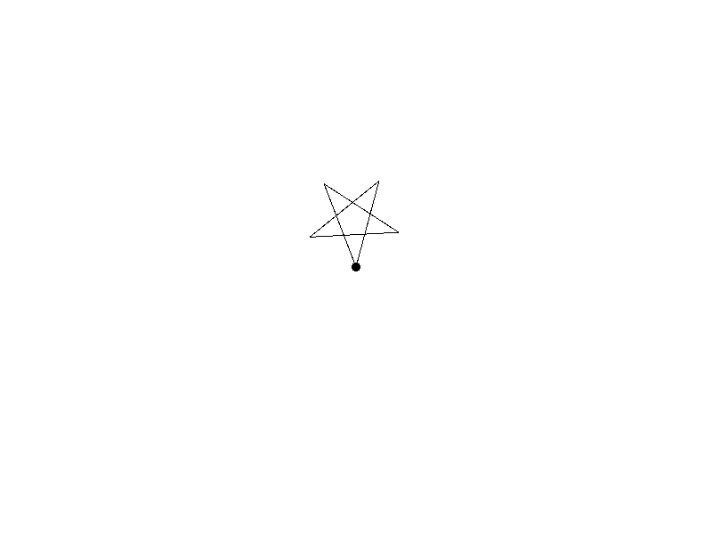

---

### Example 2: Moving the Turtle

```c
#include "turtle/turtle.h"

void draw_movement(Turtle *state) {
    static bool drawn = false; // static variable to ensure drawing happens once

    if (!drawn) {
        turtle_forward(state, 50);
        turtle_right(state, 90);
        turtle_forward(state, 50);
        turtle_right(state, 90);
        turtle_forward(state, 50);
        turtle_right(state, 90);
        turtle_forward(state, 50);
        drawn = true;
    }
}

int main(void) {
    const int screenWidth = 800;
    const int screenHeight = 600;

    Turtle *state = turtle_create();
    turtle_init_window(screenWidth, screenHeight, "Turtle Movement Example");
    turtle_set_fps(60);
    turtle_set_speed(state, 3.0f);

    turtle_done(state, draw_movement);

    turtle_deallocate(state);
    turtle_close_window();

    return 0;
}
```
**Result:**
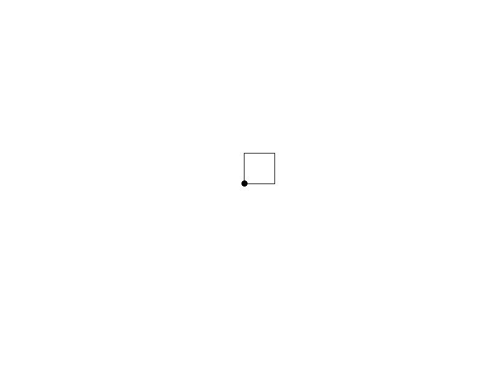

---

### Example 3: Changing the Drawing Color

```c
#include "turtle/turtle.h"

// draw always
void draw_colored_line(Turtle *state) {
    turtle_set_color(state, 255, 0, 0, 255); // Red color
    turtle_forward(state, 100);
    turtle_right(state, 90);
    turtle_set_color(state, 0, 255, 0, 255); // Green color
    turtle_forward(state, 100);
    turtle_right(state, 90);
    turtle_set_color(state, 0, 0, 255, 255); // Blue color
    turtle_forward(state, 100);
    turtle_right(state, 90);
    turtle_set_color(state, 255, 255, 0, 255); // Yellow color
    turtle_forward(state, 100);
}

void draw_colored_line_once(Turtle *state) {
    static bool drawn = false;

    if (!drawn) {
        turtle_set_color(state, 255, 0, 0, 255); // Red color
        turtle_forward(state, 100);
        turtle_right(state, 90);
        turtle_set_color(state, 0, 255, 0, 255); // Green color
        turtle_forward(state, 100);
        turtle_right(state, 90);
        turtle_set_color(state, 0, 0, 255, 255); // Blue color
        turtle_forward(state, 100);
        turtle_right(state, 90);
        turtle_set_color(state, 255, 255, 0, 255); // Yellow color
        turtle_forward(state, 100);
        drawn = true;
    }
}

int main(void) {
    const int screenWidth = 800;
    const int screenHeight = 600;

    Turtle *state = turtle_create();
    turtle_init_window(screenWidth, screenHeight, "Turtle Color Example");
    turtle_set_fps(60);
    turtle_set_speed(state, 2.0f);

    turtle_done(state, draw_colored_line_once);

    turtle_deallocate(state);
    turtle_close_window();

    return 0;
}
```
**Result:**
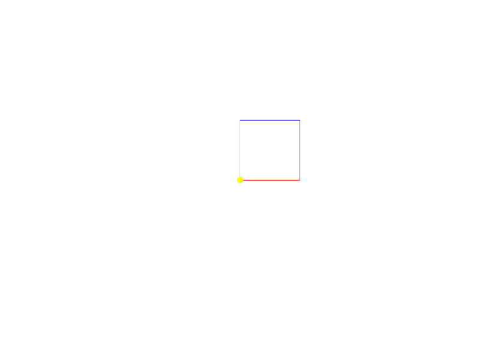


---

### Example 4: Using Pen Up and Pen Down

```c
#include "turtle/turtle.h"

void draw_with_pen_control(Turtle *state) {
    static bool drawn = false;

    if (!drawn) {
        turtle_forward(state, 50);
        turtle_pen_up(state);
        turtle_forward(state, 50);
        turtle_pen_down(state);
        turtle_forward(state, 50);
        drawn = true; 
    }
}

int main(void) {
    const int screenWidth = 800;
    const int screenHeight = 600;

    Turtle *state = turtle_create();
    turtle_init_window(screenWidth, screenHeight, "Turtle Pen Control Example");
    turtle_set_fps(60);
    turtle_set_speed(state, 2.0f);

    turtle_done(state, draw_with_pen_control);

    turtle_deallocate(state);
    turtle_close_window();

    return 0;
}

```
**Result:**
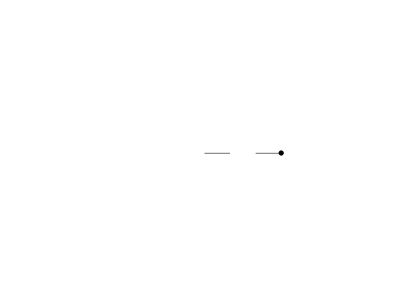


---

## Example 5 : Setting the turtle position with `turtle_set_position`

```c
#include "turtle/turtle.h"

void draw_set_position(Turtle *state) {
    static bool drawn = false; // Static variable to ensure drawing happens once

    if (!drawn) {
        turtle_set_position(state, 200, 200);
        turtle_forward(state, 100);
        turtle_set_position(state, 400, 400);
        turtle_forward(state, 100);
        drawn = true; // Mark as drawn
    }
}

int main(void) {
    const int screenWidth = 800;
    const int screenHeight = 600;

    Turtle *state = turtle_create();
    turtle_init_window(screenWidth, screenHeight, "Turtle Set Position Example");
    turtle_set_fps(60);
    turtle_set_speed(state, 2.0f);

    turtle_done(state, draw_set_position);

    turtle_deallocate(state);
    turtle_close_window();

    return 0;
}

```
**Result:**
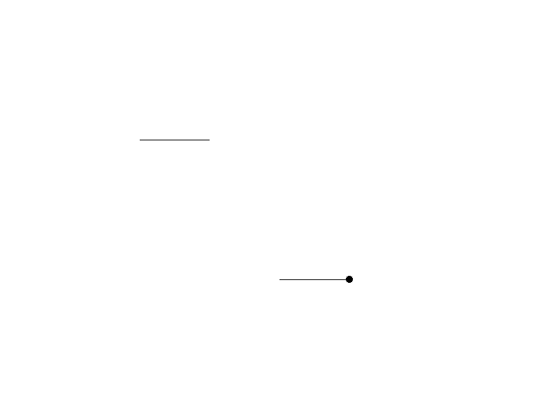


---

## Example 6: turning the turtle left 

```c
#include "turtle/turtle.h"

void draw_left_turn(Turtle *state) {
    turtle_forward(state, 100);
    turtle_left(state, 90);
    turtle_forward(state, 100);
    turtle_left(state, 90);
    turtle_forward(state, 100);
    turtle_left(state, 90);
    turtle_forward(state, 100);
}

int main(void) {
    const int screenWidth = 800;
    const int screenHeight = 600;

    Turtle *state = turtle_create();
    turtle_init_window(screenWidth, screenHeight, "Turtle Left Turn Example");
    turtle_set_fps(60);
    turtle_set_speed(state, 2.0f);

    turtle_done(state, draw_left_turn);

    turtle_deallocate(state);
    turtle_close_window();

    return 0;
}
```
**Result:**
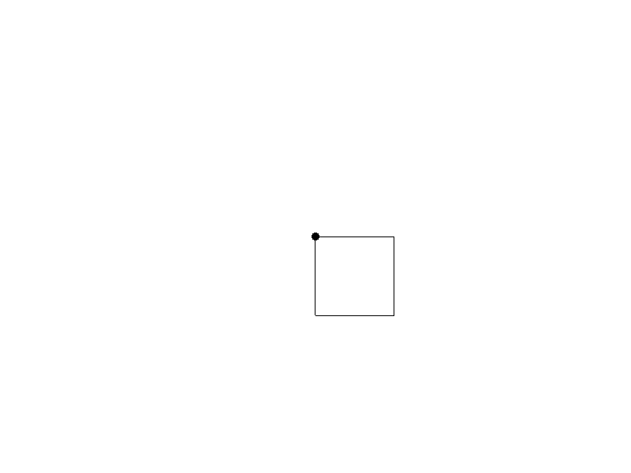

---

## Example 7 : set x and y with `turtle_set_x | turtle_set_y`

```c
#include "turtle/turtle.h"

void draw_set_position(Turtle *state) {
    static bool drawn = false; 

    if (!drawn) {
        turtle_set_x(state, 200);
        turtle_forward(state, 100);
        turtle_set_y(state, 400);
        turtle_forward(state, 100);
        drawn = true; 
    }
}

int main(void) {
    const int screenWidth = 800;
    const int screenHeight = 600;

    Turtle *state = turtle_create();
    
    turtle_init_window(screenWidth, screenHeight, "Turtle Set Position Example");
    turtle_set_fps(60);
    turtle_set_speed(state, 2.0f);

    turtle_done(state, draw_set_position);

    turtle_deallocate(state);
    turtle_close_window();

    return 0;
}
```
**Result:**
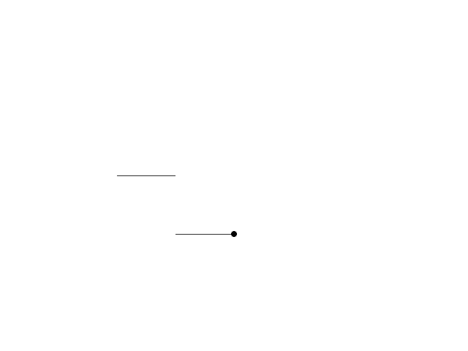


---

## Example 8 : set heading with `turtle_set_heading`
```c
#include "turtle/turtle.h"

void draw_set_heading(Turtle *state) {
    static bool drawn = false; 

    if (!drawn) {
        turtle_set_heading(state, 90);
        turtle_forward(state, 100);
        turtle_set_heading(state, 180);
        turtle_forward(state, 100);
        drawn = true; 
    }
}

int main(void) {
    const int screenWidth = 800;
    const int screenHeight = 600;

    Turtle *state = turtle_create();
    turtle_init_window(screenWidth, screenHeight, "Turtle Set Heading Example");
    turtle_set_fps(60);
    turtle_set_speed(state, 2.0f);

    turtle_done(state, draw_set_heading);

    turtle_deallocate(state);
    turtle_close_window();

    return 0;
}
```
**Result:**
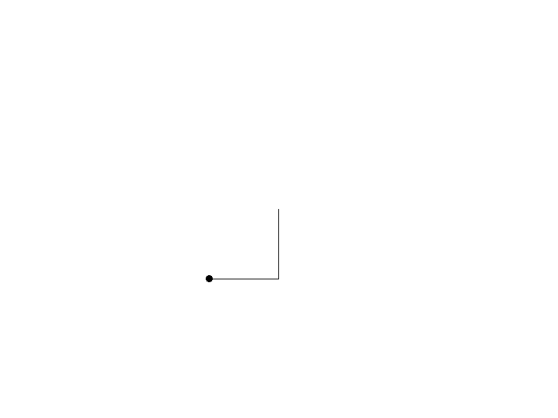


---

## Example 9 : how to send angle to home position with `turtle_home`

```c
#include "turtle/turtle.h"

void draw_home(Turtle *state) {
    static bool drawn = false;

    if (!drawn) {
        turtle_forward(state, 100);
        turtle_set_heading(state, 90);
        turtle_forward(state, 100);
        turtle_home(state);
        drawn = true;
    }
}

int main(void) {
    const int screenWidth = 800;
    const int screenHeight = 600;

    Turtle *state = turtle_create();
    turtle_init_window(screenWidth, screenHeight, "Turtle Home Example");
    turtle_set_fps(60);
    turtle_set_speed(state, 2.0f);

    turtle_done(state, draw_home);

    turtle_deallocate(state);
    turtle_close_window();

    return 0;
}
```
**Result:**
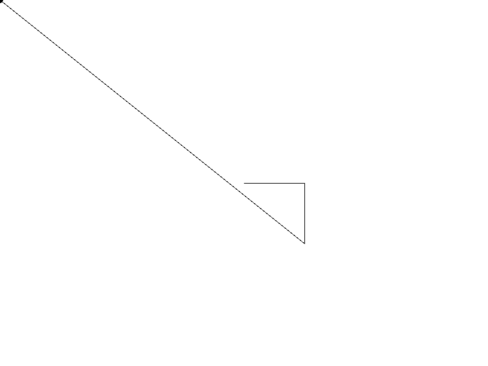


---

## Example 10 : how to draw a circle with `turtle_circle`

```c
#include "turtle/turtle.h"

void draw_circle(Turtle *state) {
    static bool drawn = false;

    if (!drawn) {
        turtle_circle(state, 50, 360, 0);
        drawn = true;
    }
}

int main(void) {
    const int screenWidth = 800;
    const int screenHeight = 600;

    Turtle *state = turtle_create();
    turtle_init_window(screenWidth, screenHeight, "Turtle Circle Example");
    turtle_set_fps(60);
    turtle_set_speed(state, 2.0f);

    turtle_done(state, draw_circle);

    turtle_deallocate(state);
    turtle_close_window();

    return 0;
}
```
**Result:**
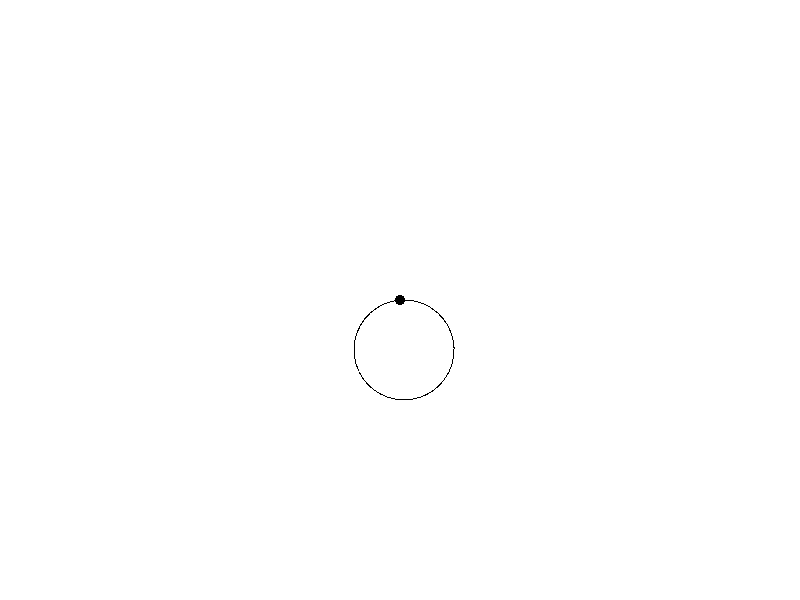


---

## Example 11 : draw dot with `turtle_dot`

```c
#include "turtle/turtle.h"

void draw_dot(Turtle *state) {
    static bool drawn = false;

    if (!drawn) {
        turtle_dot(state, 20, 255, 0, 0, 255);  // draw a red dot with size 20
        drawn = true;
    }
}

int main(void) {
    const int screenWidth = 800;
    const int screenHeight = 600;

    Turtle *state = turtle_create();
    turtle_init_window(screenWidth, screenHeight, "Turtle Dot Example");
    turtle_set_fps(60);
    turtle_set_speed(state, 2.0f);

    turtle_done(state, draw_dot);

    turtle_deallocate(state);
    turtle_close_window();

    return 0;
}

```
**Result:**
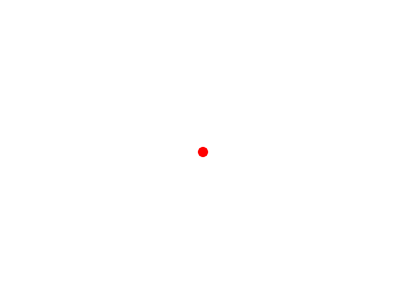

---

## Example 12 : clear stamp 

```c
#include "turtle/turtle.h"

void draw_stamps(Turtle *state) {
    static bool drawn = false;
    static int stamp_id;

    if (!drawn) {
        turtle_set_color(state, 0, 0, 255, 255);  
        stamp_id = turtle_stamp(state);          // Stamp the turtle at the current position
        turtle_forward(state, 50);                
        turtle_clear_stamp(state, stamp_id);     // Clear the previously stamped turtle
        drawn = true; 
    }
}

int main(void) {
    const int screenWidth = 800;
    const int screenHeight = 600;

    Turtle *state = turtle_create();
    turtle_init_window(screenWidth, screenHeight, "Turtle Stamp Example");
    turtle_set_fps(60);
    turtle_set_speed(state, 2.0f);

    turtle_done(state, draw_stamps);

    turtle_deallocate(state);
    turtle_close_window();

    return 0;
}
```
**Result:**
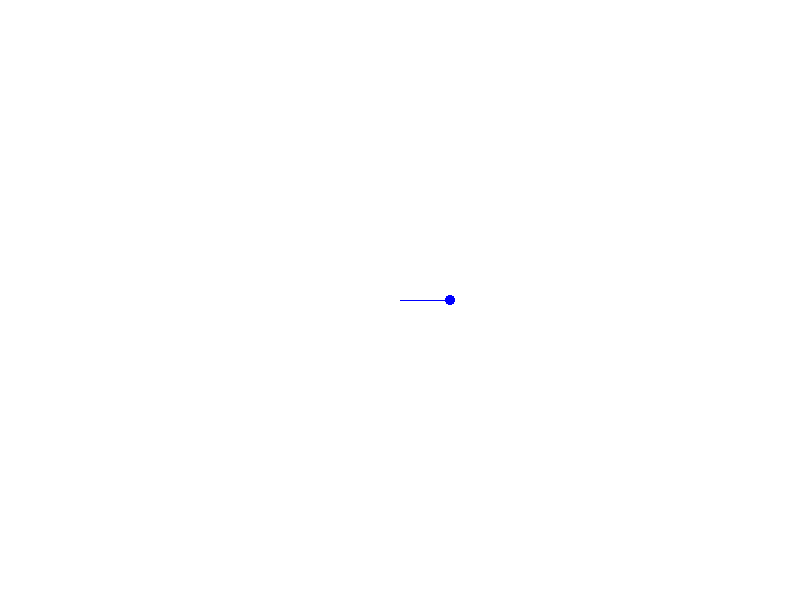


---

## Example 13 : calculate the distance with `turtle_distance | turtle_distance_turtle`

```c
#include "turtle/turtle.h"
#include "fmt/fmt.h"

void draw_distance(Turtle *state) {
    static bool drawn = false;
    if (!drawn) {
        turtle_home(state);
        float dist = turtle_distance(state, 30, 40);
        fmt_printf("Distance to (30, 40): %f\n", dist);

        Tu other_turtle;
        other_turtle.position = (Vector2){400.0f, 300.0f};
        other_turtle.heading = 0.0f;
        other_turtle.pencolor = BLACK;
        other_turtle.penDown = true;
        other_turtle.speed = 1.0f;
        other_turtle.thickness = 1.0f;

        turtle_forward(state, 77);
        dist = turtle_distance_turtle(state, &other_turtle);
        fmt_printf("Distance to other turtle: %f\n", dist);

        drawn = true;
    }
}

int main(void) {
    const int screenWidth = 800;
    const int screenHeight = 600;

    Turtle *state = turtle_create();
    turtle_init_window(screenWidth, screenHeight, "Turtle Distance Example");
    turtle_set_fps(60);
    turtle_set_speed(state, 2.0f);

    turtle_done(state, draw_distance);

    turtle_deallocate(state);
    turtle_close_window();

    return 0;
}
```
**Result:**
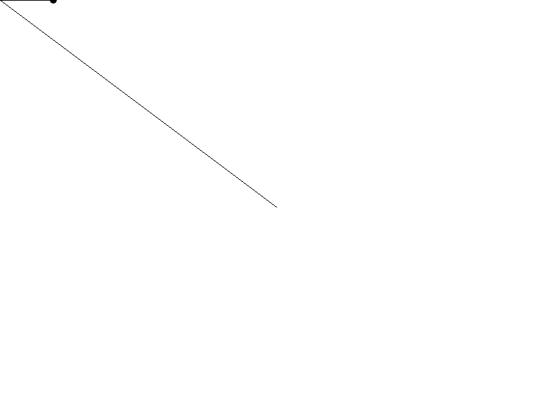


---

## Example 14 : change size of pen also check pen is down or up `turtle_pen_size | turtle_get_pen_size | turtle_is_down`

```c
#include "turtle/turtle.h"
#include "fmt/fmt.h"

void draw_pen(Turtle *state) {
    static bool drawn = false;
    if (!drawn) {
        fmt_printf("current pen size: %f\n", turtle_get_pen_size(state));
        turtle_pen_size(state, 10);
        fmt_printf("new pen size: %f\n", turtle_get_pen_size(state));

        turtle_pen_down(state);
        fmt_printf("is pen down? %s\n", turtle_is_down(state) ? "Yes" : "No");

        turtle_forward(state, 100);
        turtle_right(state, 90);
        turtle_forward(state, 100);

        turtle_pen_up(state);
        fmt_printf("is pen down? %s\n", turtle_is_down(state) ? "Yes" : "No");

        drawn = true;
    }
}

int main(void) {
    const int screenWidth = 800;
    const int screenHeight = 600;

    Turtle *state = turtle_create();
    turtle_init_window(screenWidth, screenHeight, "Turtle Pen Size Example");
    turtle_set_fps(60);
    turtle_set_speed(state, 2.0f);

    turtle_done(state, draw_pen);

    turtle_deallocate(state);
    turtle_close_window();

    return 0;
}
```
**Result:**
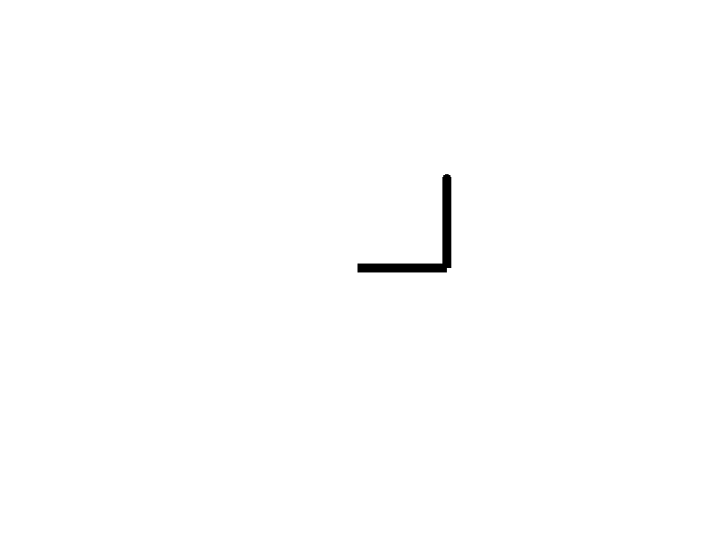


---

## Example 15 : star shape 

```c
#include "turtle/turtle.h"
#include "fmt/fmt.h"

void draw_spiral(Turtle *state) {
    static bool drawn = false;

    if (!drawn) {
        float a = 0;
        float b = 0;

        turtle_set_color(state, 255, 0, 0, 255);  
        turtle_pen_up(state);
        turtle_set_position(state, 400, 400);    
        turtle_pen_down(state);

        while (true) {
            turtle_forward(state, a);
            turtle_right(state, b);
        
            a += 3;
            b += 1;
            if (b >= 210) {
                break;
            }
        }

        turtle_pen_up(state);  // Hide the turtle
        drawn = true;
    }
}

int main(void) {
    const int screenWidth = 800;
    const int screenHeight = 600;

    Turtle *state = turtle_create();
    turtle_init_window(screenWidth, screenHeight, "Turtle Spiral Example");
    turtle_set_fps(60);
    turtle_set_speed(state, 2.0f);
    turtle_set_background_color(state, 0, 0, 0, 255);  // black

    turtle_done(state, draw_spiral);

    turtle_deallocate(state);
    turtle_close_window();

    return 0;
}
```
**Result:**
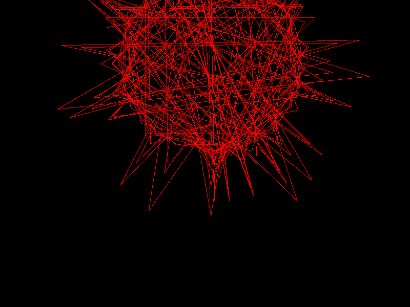


---

## Example 16 : create colorize shape `Circle spiro graph`

```c
#include "turtle/turtle.h"

void draw_circles(Turtle *state) {
    Color colors[] = {
        {255, 0, 0, 255},      // red
        {0, 0, 255, 255},      // blue
        {255, 0, 255, 255},    // magenta
        {0, 255, 0, 255},      // green
        {255, 255, 0, 255},    // yellow
        {255, 255, 255, 255}   // white
    };

    const int num_colors = sizeof(colors) / sizeof(colors[0]);

    static bool drawn = false;
    if (!drawn) {
        for (int i = 0; i < 6; i++) {
            for (int j = 0; j < num_colors; j++) {
                turtle_set_color(state, colors[j].r, colors[j].g, colors[j].b, colors[j].a);
                turtle_circle(state, 100, 360, 36);
                turtle_left(state, 10);
            }
        }
        drawn = true;
    }
}

int main(void) {
    const int screenWidth = 800;
    const int screenHeight = 600;

    Turtle *state = turtle_create();
    turtle_init_window(screenWidth, screenHeight, "Turtle Circles Example");
    turtle_set_fps(60);
    turtle_set_speed(state, 10.f);
    turtle_set_background_color(state, 0, 0, 0, 255); // black

    turtle_done(state, draw_circles);

    turtle_deallocate(state);
    turtle_close_window();

    return 0;
}
```
**Result:**
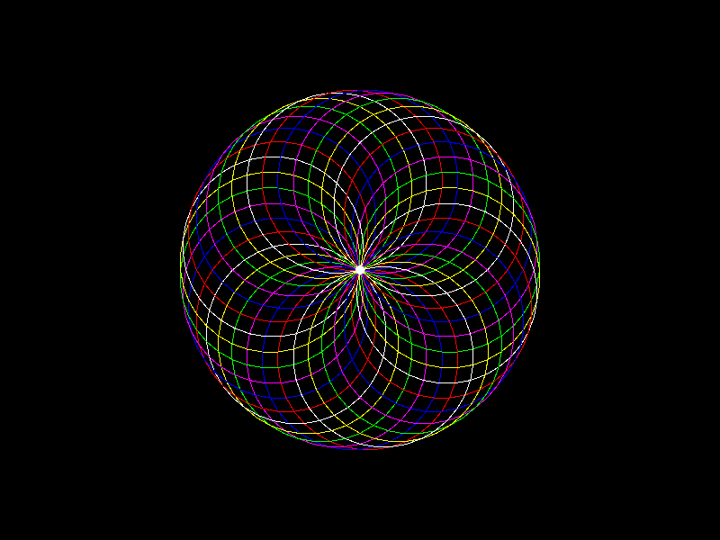


---

## Example 17 : circle 

```c
#include "turtle/turtle.h"

void draw_circle(Turtle *state) {
    static bool drawn = false; 
    int n = 10;

    if (!drawn) {
        while (n <= 60) {
            turtle_circle(state, n, 360, 36);  
            n += 10;
        }
        drawn = true; 
    }
}

int main(void) {
    const int screenWidth = 800;
    const int screenHeight = 600;

    Turtle *state = turtle_create();
    turtle_init_window(screenWidth, screenHeight, "Turtle Circle Example");
    turtle_set_fps(60);
    turtle_set_speed(state, 2.0f);

    turtle_done(state, draw_circle);

    turtle_deallocate(state);
    turtle_close_window();

    return 0;
}
```
**Result:**
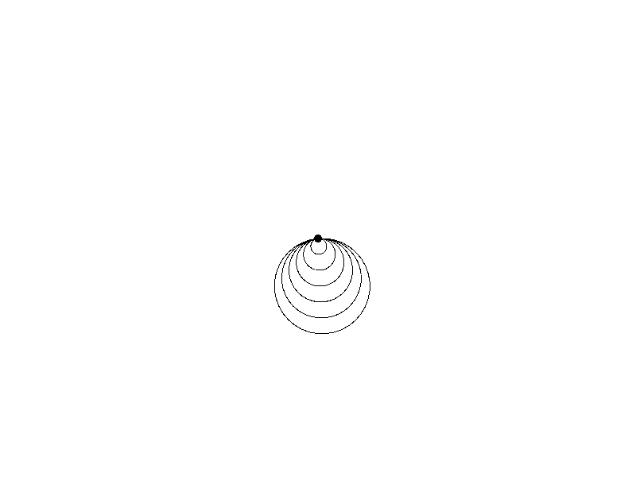


---

## Example 18 : Drawing a Spiral Pattern 
```c
#include <math.h>
#include "turtle/turtle.h"

void draw_spiral(Turtle *state) {
    static bool drawn = false;

    if (!drawn) {
        for (int i = 0; i < 360; i++) {
            // Set the color based on the angle to create a gradient effect
            int red = (int)(127 * (1 + cos(DEG2RAD * i)));
            int green = (int)(127 * (1 + sin(DEG2RAD * i)));
            int blue = 255 - red;

            turtle_set_color(state, red, green, blue, 255);
            turtle_forward(state, i * 0.5);
            turtle_right(state, 59); 
        }
        drawn = true;
    }
}

int main(void) {
    const int screenWidth = 800;
    const int screenHeight = 600;

    Turtle *state = turtle_create();
    turtle_init_window(screenWidth, screenHeight, "Turtle Spiral Pattern Example");
    turtle_set_fps(60);
    turtle_set_speed(state, 5.0f);

    turtle_done(state, draw_spiral);

    turtle_deallocate(state);
    turtle_close_window();

    return 0;
}
```
**Result:**
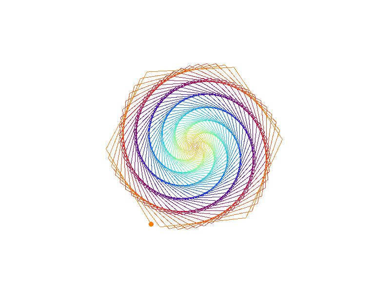


---

## Example 19 : Drawing a flower Pattern 
```c
#include <math.h>
#include "turtle/turtle.h"


void draw_petal(Turtle *state, float radius, float angle) {
    for (int i = 0; i < 2; i++) {
        turtle_circle(state, radius, angle, 50);
        turtle_right(state, 180 - angle);
    }
}

void draw_flower(Turtle *state) {
    static bool drawn = false;
    if (!drawn) {
        for (int i = 0; i < 36; i++) {
            // Set the color based on the angle to create a gradient effect
            int red = (int)(127 * (1 + cos(DEG2RAD * i * 10)));
            int green = (int)(127 * (1 + sin(DEG2RAD * i * 10)));
            int blue = 255 - red;

            turtle_set_color(state, red, green, blue, 255);
            draw_petal(state, 50, 60);
            turtle_right(state, 10);
        }
        drawn = true;
    }
}

int main(void) {
    const int screenWidth = 800;
    const int screenHeight = 600;

    Turtle *state = turtle_create();
    turtle_init_window(screenWidth, screenHeight, "Turtle Flower Pattern Example");
    turtle_set_fps(60);
    turtle_set_speed(state, 5.0f);

    turtle_done(state, draw_flower);

    turtle_deallocate(state);
    turtle_close_window();

    return 0;
}
```
**Result:**
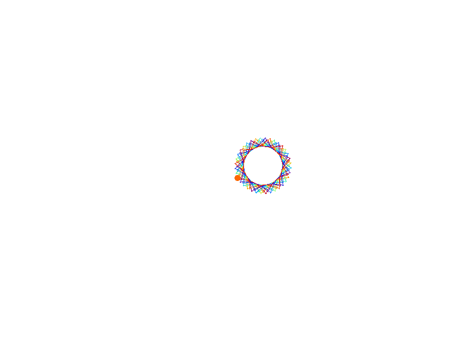


---

## Example 20 : Drawing a hexagonal Spiral 

```c
#include <math.h>
#include "turtle/turtle.h"


void draw_hexagonal_spiral(Turtle *state) {
    static bool drawn = false;
    if (!drawn) {
        float length = 10.0f;
        for (int i = 0; i < 100; i++) {
            
            int red = (int)(127 * (1 + cos(DEG2RAD * i * 3.6)));
            int green = (int)(127 * (1 + sin(DEG2RAD * i * 3.6)));
            int blue = 255 - red;

            turtle_set_color(state, red, green, blue, 255);
            turtle_forward(state, length);
            turtle_right(state, 60); 
            length += 2.0f; 
        }
        drawn = true;
    }
}

int main(void) {
    const int screenWidth = 800;
    const int screenHeight = 600;

    Turtle *state = turtle_create();
    turtle_init_window(screenWidth, screenHeight, "Turtle Hexagonal Spiral Example");
    turtle_set_fps(60);
    turtle_set_speed(state, 5.0f);

    turtle_done(state, draw_hexagonal_spiral);

    turtle_deallocate(state);
    turtle_close_window();

    return 0;
}
```
**Result:**
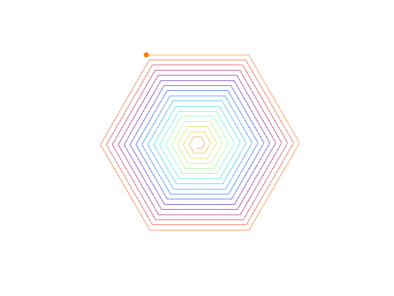


---

## Example 21 : draw a heart 

```c
#include <math.h>
#include "turtle/turtle.h"


void curve(Turtle *state) {
    for (int i = 0; i < 200; i++) {
        turtle_left(state, 1);
        turtle_forward(state, 1);
    }
}

void draw_heart(Turtle *state) {
    static bool drawn = false;
    if (!drawn) {
        turtle_set_speed(state, 3.0f);
        
        turtle_set_color(state, 255, 0, 0, 255);
        turtle_pen_size(state, 5);
        
        turtle_color(state, "#FF0000", "#FFFFFF");
        turtle_begin_fill(state);

        turtle_right(state, 140); 
        turtle_forward(state, 111.65);
        curve(state);
        turtle_right(state, 120);
        curve(state);
        turtle_forward(state, 111.65);
        
        turtle_end_fill(state);
        
        drawn = true;
    }
}

int main(void) {
    const int screenWidth = 800;
    const int screenHeight = 600;

    Turtle *state = turtle_create();
    turtle_init_window(screenWidth, screenHeight, "Turtle Heart Shape Example");
    turtle_set_fps(60);

    turtle_set_background_color(state, 0, 0, 0, 255);
    turtle_done(state, draw_heart);

    turtle_deallocate(state);
    turtle_close_window();

    return 0;
}
```
**Result:**
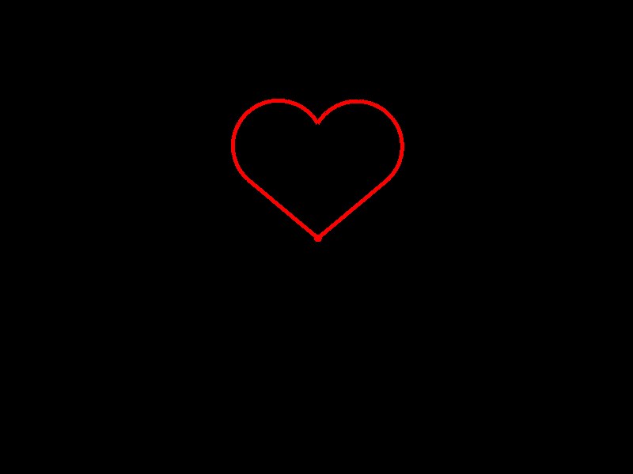


---

## Example A — Read where the turtle is

```c
#include "turtle/turtle.h"
#include "fmt/fmt.h"

int main(void) {
    Turtle* t = turtle_create();
    fmt_printf("start at (%.0f, %.0f)\n", turtle_get_x(t), turtle_get_y(t));
    turtle_deallocate(t);
    return 0;
}
```

**Output**

```
start at (400, 300)
```

---

## Example B — Read back pen / fill / background colors

```c
#include "turtle/turtle.h"
#include "fmt/fmt.h"

int main(void) {
    Turtle* t = turtle_create();
    turtle_set_color(t, 200, 60, 30, 255);
    turtle_set_background_color(t, 240, 240, 250, 255);

    unsigned char r, g, b, a;
    turtle_get_pen_color(t, &r, &g, &b, &a);
    fmt_printf("pen        = %u %u %u %u\n", r, g, b, a);

    turtle_get_background_color(t, &r, &g, &b, &a);
    fmt_printf("background = %u %u %u %u\n", r, g, b, a);

    turtle_deallocate(t);
    return 0;
}
```

**Output**

```
pen        = 200 60 30 255
background = 240 240 250 255
```

---

## Example C — `turtle_reset` brings everything back to start

```c
#include "turtle/turtle.h"
#include "fmt/fmt.h"

int main(void) {
    Turtle* t = turtle_create();
    turtle_set_position(t, 100.f, 100.f);
    turtle_set_heading (t, 90.f);
    turtle_pen_up(t);

    turtle_reset(t);
    fmt_printf("pos = (%.0f, %.0f), heading = %.0f, pen down = %d\n",
               turtle_get_x(t), turtle_get_y(t),
               turtle_heading(t), turtle_is_down(t));
    turtle_deallocate(t);
    return 0;
}
```

**Output**

```
pos = (400, 300), heading = 0, pen down = 1
```

---

## Example D — `turtle_clear` keeps the turtle where it is

```c
#include "turtle/turtle.h"
#include "fmt/fmt.h"

int main(void) {
    Turtle* t = turtle_create();
    turtle_set_position(t, 250.f, 250.f);
    turtle_pen_up(t);

    /* Pretend we added some lines (we'd normally call forward here). */
    t->lines[t->lineCount++] = (Line){{0,0},{1,1},BLACK,1.0f};
    t->lines[t->lineCount++] = (Line){{0,0},{1,1},BLACK,1.0f};

    turtle_clear(t);   /* drawings gone, state preserved */

    fmt_printf("lines  = %d\n",        turtle_get_line_count(t));
    fmt_printf("pos    = (%.0f, %.0f)\n", turtle_get_x(t), turtle_get_y(t));
    fmt_printf("pen up = %d\n",        !turtle_is_down(t));
    turtle_deallocate(t);
    return 0;
}
```

**Output**

```
lines  = 0
pos    = (250, 250)
pen up = 1
```

---

## Example E — `turtle_undo` rolls back one line

```c
#include "turtle/turtle.h"
#include "fmt/fmt.h"

int main(void) {
    Turtle* t = turtle_create();
    /* Stuff three fake line segments. */
    for (int i = 0; i < 3; ++i)
        t->lines[t->lineCount++] = (Line){{0,0},{1,1},BLACK,1.0f};

    fmt_printf("before: %d\n", turtle_get_line_count(t));
    turtle_undo(t);
    fmt_printf("after : %d\n", turtle_get_line_count(t));
    turtle_deallocate(t);
    return 0;
}
```

**Output**

```
before: 3
after : 2
```

---

## Example F — `turtle_towards` gives the bearing to a point

```c
#include "turtle/turtle.h"
#include "fmt/fmt.h"

int main(void) {
    Turtle* t = turtle_create();
    turtle_set_position(t, 100.f, 100.f);

    fmt_printf("east  -> %.1f\n", turtle_towards(t, 200.f, 100.f));
    fmt_printf("south -> %.1f\n", turtle_towards(t, 100.f, 200.f));
    fmt_printf("west  -> %.1f\n", turtle_towards(t,   0.f, 100.f));
    fmt_printf("north -> %.1f\n", turtle_towards(t, 100.f,   0.f));

    turtle_deallocate(t);
    return 0;
}
```

**Output**

```
east  -> 0.0
south -> 90.0
west  -> 180.0
north -> 270.0
```

---

## Example G — `turtle_face_towards` aims at the cursor without moving

```c
#include "turtle/turtle.h"
#include "fmt/fmt.h"

int main(void) {
    Turtle* t = turtle_create();
    turtle_set_position(t, 100.f, 100.f);

    turtle_face_towards(t, 200.f, 200.f);
    fmt_printf("heading = %.1f\n", turtle_heading(t));

    turtle_face_towards(t, 100.f,   0.f);
    fmt_printf("heading = %.1f\n", turtle_heading(t));

    turtle_deallocate(t);
    return 0;
}
```

**Output**

```
heading = 45.0
heading = 270.0
```

---

## Example H — Counts make for cheap progress reporting

```c
#include "turtle/turtle.h"
#include "fmt/fmt.h"

int main(void) {
    Turtle* t = turtle_create();
    t->lines[t->lineCount++] = (Line){{0,0},{1,1},BLACK,1.0f};
    t->stamps[t->stampCount++] = (Stamp){{0,0},BLACK,1};
    t->stamps[t->stampCount++] = (Stamp){{0,0},BLACK,2};

    fmt_printf("lines=%d stamps=%d\n",
               turtle_get_line_count(t),
               turtle_get_stamp_count(t));
    turtle_deallocate(t);
    return 0;
}
```

**Output**

```
lines=1 stamps=2
```

---

## Example I — Set pen color without touching fill

```c
#include "turtle/turtle.h"
#include "fmt/fmt.h"

int main(void) {
    Turtle* t = turtle_create();
    /* Give fill an obvious value first. */
    turtle_color_rgb(t, 0,0,0, 200, 200, 50);

    turtle_set_pen_color_rgb(t, 30, 60, 90, 255);

    unsigned char r, g, b, a;
    turtle_get_pen_color (t, &r, &g, &b, &a);
    fmt_printf("pen  = %u %u %u %u\n", r, g, b, a);
    turtle_get_fill_color(t, &r, &g, &b, &a);
    fmt_printf("fill = %u %u %u %u (unchanged)\n", r, g, b, a);

    turtle_deallocate(t);
    return 0;
}
```

**Output**

```
pen  = 30 60 90 255
fill = 200 200 50 255 (unchanged)
```

---

## Example J — `turtle_get_speed` round-trips

```c
#include "turtle/turtle.h"
#include "fmt/fmt.h"

int main(void) {
    Turtle* t = turtle_create();
    turtle_set_speed(t, 4.0f);
    fmt_printf("speed = %.1f\n", turtle_get_speed(t));
    turtle_deallocate(t);
    return 0;
}
```

**Output**

```
speed = 4.0
```

---

## Example K — Backward = forward(-d)

```c
#include "turtle/turtle.h"
#include "fmt/fmt.h"

/* This example needs a window because turtle_forward animates;
 * if you're in a headless test, validate state manually instead. */
int main(void) {
    turtle_init_window(640, 480, "backward demo");
    Turtle* t = turtle_create();
    turtle_set_position(t, 320.f, 240.f);
    turtle_set_heading (t, 0.f);

    turtle_forward (t, 100.f);   /* +100 along x */
    turtle_backward(t, 50.f);    /* go back 50  */

    fmt_printf("final x = %.0f (expected 370)\n", turtle_get_x(t));
    turtle_deallocate(t);
    turtle_close_window();
    return 0;
}
```

---

## Example L — Drive a turtle to a target with `face_towards` + `forward`

```c
#include "turtle/turtle.h"

int main(void) {
    turtle_init_window(640, 480, "homing turtle");
    Turtle* t = turtle_create();
    turtle_set_position(t, 100.f, 100.f);
    turtle_pen_down(t);

    float tx = 500.f, ty = 400.f;
    turtle_face_towards(t, tx, ty);
    turtle_forward(t, turtle_distance(t, tx, ty));

    turtle_done(t, NULL);
    turtle_close_window();
    return 0;
}
```

The turtle walks in a single straight line from `(100, 100)` to
`(500, 400)`, regardless of its previous heading.

---

## Example M — Animation loop with `turtle_clear` for redraw

```c
#include "turtle/turtle.h"

static void redraw(Turtle* t) {
    /* Each frame: clear the previous drawing, then re-draw whatever
       is current. This pattern keeps the line buffer from growing
       without bound when you regenerate the scene every frame. */
    turtle_clear(t);
    /* ... your shape-drawing code here ... */
    (void)t;
}

int main(void) {
    turtle_init_window(640, 480, "redraw");
    Turtle* t = turtle_create();
    turtle_done(t, redraw);
    turtle_deallocate(t);
    turtle_close_window();
    return 0;
}
```

---

## Example N — Mid-program palette swap with reset

```c
#include "turtle/turtle.h"
#include "fmt/fmt.h"

int main(void) {
    Turtle* t = turtle_create();
    turtle_set_color(t, 200, 60, 30, 255);
    turtle_set_position(t, 100.f, 100.f);

    /* Wipe everything and start fresh with the default palette. */
    turtle_reset(t);

    unsigned char r, g, b, a;
    turtle_get_pen_color(t, &r, &g, &b, &a);
    fmt_printf("pen after reset = %u %u %u %u\n", r, g, b, a);

    turtle_deallocate(t);
    return 0;
}
```

**Output**

```
pen after reset = 0 0 0 255
```

---

## Example O — Build a tour: walk between N points using `towards`

```c
#include "turtle/turtle.h"


int main(void) {
    turtle_init_window(640, 480, "tour");
    Turtle* t = turtle_create();
    turtle_set_position(t, 100.f, 240.f);
    turtle_pen_down(t);

    /* Visit each waypoint in order. */
    Vector2 waypoints[] = {
        {200.f, 100.f}, {400.f, 100.f}, {540.f, 240.f},
        {400.f, 380.f}, {200.f, 380.f}, {100.f, 240.f},
    };
    for (int i = 0; i < 6; ++i) {
        turtle_face_towards(t, waypoints[i].x, waypoints[i].y);
        turtle_forward(t, turtle_distance(t, waypoints[i].x, waypoints[i].y));
    }

    turtle_done(t, NULL);
    turtle_close_window();
    return 0;
}
```

A simple "visit each waypoint" loop that draws a closed hexagon-ish
shape — no manual angle math.

---

## Example 22: Rainbow Square Spiral

Each iteration draws one side of a growing square, rotating the hue
slightly each time to produce a full-spectrum spiral on a dark background.

```c
#include <math.h>
#include "turtle/turtle.h"


void draw_rainbow_spiral(Turtle *state) {
    static bool drawn = false;

    if (!drawn) {
        turtle_set_background_color(state, 10, 10, 30, 255);
        int side = 10;

        for (int i = 0; i < 100; i++) {
            float hue = (float)(i * 3.6f);
            unsigned char r = (unsigned char)(127 * (1.0 + cos(DEG2RAD * hue)));
            unsigned char g = (unsigned char)(127 * (1.0 + sin(DEG2RAD * hue)));
            unsigned char b = (unsigned char)(255 - r);

            turtle_set_color(state, r, g, b, 255);
            turtle_forward(state, (float)side);
            turtle_right(state, 89.0f);

            side += 2;
        }
        drawn = true;
    }
}

int main(void) {
    Turtle *state = turtle_create();

    turtle_init_window(800, 600, "Rainbow Square Spiral");
    turtle_set_fps(60);
    turtle_set_speed(state, 10.0f);
    turtle_done(state, draw_rainbow_spiral);
    turtle_deallocate(state);
    turtle_close_window();

    return 0;
}
```

**Result:**
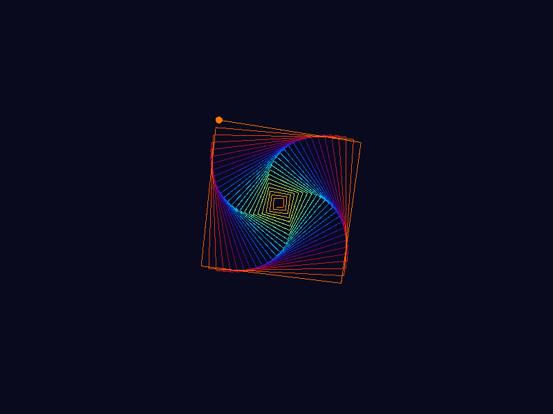

---

## Example 23: Bullseye / Concentric Rings

Draws concentric filled rings (red/white/blue) to produce a target pattern.
Each ring is drawn as a full circle at the appropriate radius.

```c
#include "turtle/turtle.h"


void draw_bullseye(Turtle *state) {
    static bool drawn = false;

    if (!drawn) {
        turtle_set_background_color(state, 255, 255, 255, 255);

        unsigned char ring_colors[5][3] = {
            {255, 0,   0},    /* outermost – red   */
            {255, 255, 255},  /* white             */
            {0,   0,   200},  /* blue              */
            {255, 255, 255},  /* white             */
            {255, 0,   0}     /* innermost – red   */
        };

        for (int ring = 4; ring >= 0; ring--) {
            float radius = (float)(ring + 1) * 40.0f;
            unsigned char *c = ring_colors[ring];

            turtle_set_color(state, c[0], c[1], c[2], 255);
            turtle_pen_up(state);
            turtle_set_position(state, 400.0f, 300.0f + radius);
            turtle_pen_down(state);
            turtle_set_heading(state, 0.0f);
            turtle_circle(state, radius, 360.0f, 60);
        }
        drawn = true;
    }
}

int main(void) {
    Turtle *state = turtle_create();

    turtle_init_window(800, 600, "Bullseye");
    turtle_set_fps(60);
    turtle_set_speed(state, 10.0f);
    turtle_done(state, draw_bullseye);
    turtle_deallocate(state);
    turtle_close_window();

    return 0;
}
```

**Result:**
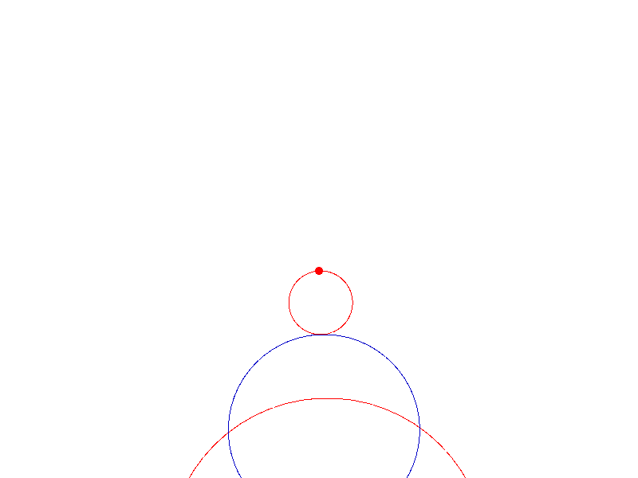

---

## Example 24: Sunburst — Radial Lines from Centre

72 coloured lines radiate outward from the screen centre, each tinted
by its angular position using a cosine/sine hue formula.

```c
#include <math.h>
#include "turtle/turtle.h"


void draw_sunburst(Turtle *state) {
    static bool drawn = false;

    if (!drawn) {
        turtle_set_background_color(state, 0, 0, 0, 255);
        turtle_pen_size(state, 2.0f);

        for (int angle = 0; angle < 360; angle += 5) {
            unsigned char r = (unsigned char)(127 + 127 * cos(DEG2RAD * angle));
            unsigned char g = (unsigned char)(127 + 127 * sin(DEG2RAD * angle));
            unsigned char b = (unsigned char)(255 - r);

            turtle_set_color(state, r, g, b, 255);
            turtle_pen_up(state);
            turtle_set_position(state, 400.0f, 300.0f);
            turtle_pen_down(state);
            turtle_set_heading(state, (float)angle);
            turtle_forward(state, 220.0f);
        }
        drawn = true;
    }
}

int main(void) {
    Turtle *state = turtle_create();

    turtle_init_window(800, 600, "Sunburst");
    turtle_set_fps(60);
    turtle_set_speed(state, 10.0f);
    turtle_done(state, draw_sunburst);
    turtle_deallocate(state);
    turtle_close_window();

    return 0;
}
```

**Result:**
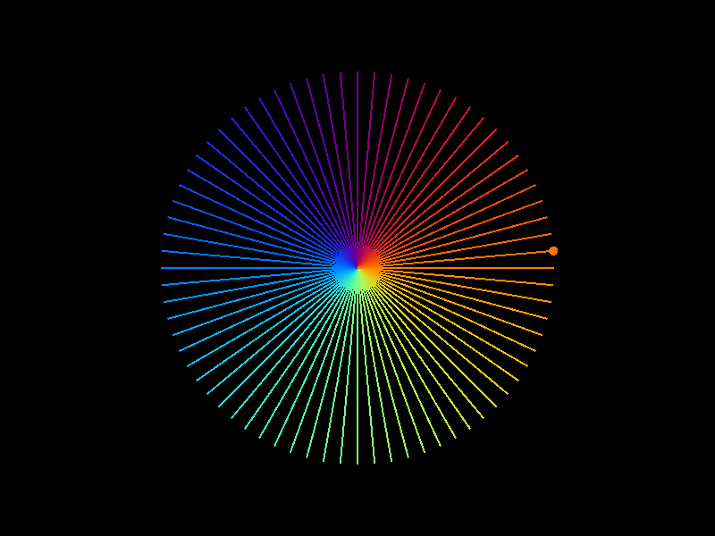

---

## Example 25: Nested Polygons (triangle → nonagon)

Draws seven polygons (3 to 9 sides) centred at the turtle's start
position, each slightly larger and in a different colour.

```c
#include <math.h>
#include "turtle/turtle.h"


void draw_nested_polygons(Turtle *state) {
    static bool drawn = false;
    if (!drawn) {
        turtle_set_background_color(state, 20, 20, 40, 255);

        for (int sides = 3; sides <= 9; sides++) {
            float hue = (float)((sides - 3) * 50);
            unsigned char r = (unsigned char)(127 + 127 * cos(DEG2RAD * hue));
            unsigned char g = (unsigned char)(127 + 127 * sin(DEG2RAD * hue));
            unsigned char b = (unsigned char)(200 - r / 2);

            turtle_set_color(state, r, g, b, 255);
            turtle_pen_up(state);
            turtle_set_position(state, 400.0f, 300.0f);
            turtle_pen_down(state);
            turtle_set_heading(state, 0.0f);

            float len = (float)(sides * 20);
            float ext = 360.0f / (float)sides;

            for (int i = 0; i < sides; i++) {
                turtle_forward(state, len);
                turtle_left(state, ext);
            }
        }
        drawn = true;
    }
}

int main(void) {
    Turtle *state = turtle_create();
    turtle_init_window(800, 600, "Nested Polygons");
    turtle_set_fps(60);
    turtle_set_speed(state, 10.0f);
    turtle_done(state, draw_nested_polygons);
    turtle_deallocate(state);
    turtle_close_window();
    return 0;
}
```

**Result:**
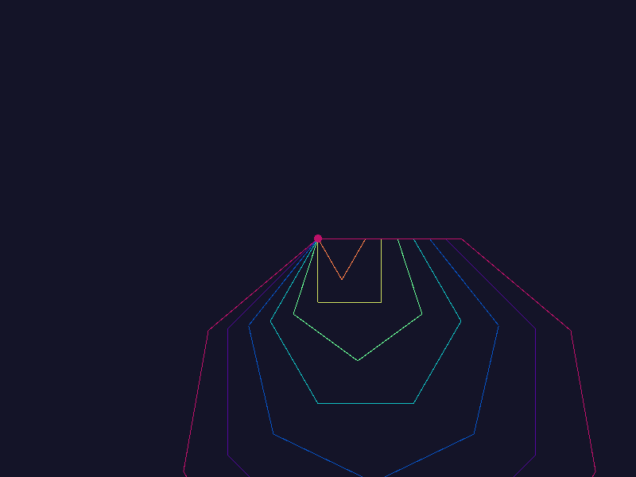

---

## Example 26: Zigzag Sine Wave

The turtle traces a sine wave across the screen using `turtle_set_position`
for each sample point, applying a gradient colour to each segment.

```c
#include <math.h>
#include "turtle/turtle.h"


void draw_sine_wave(Turtle *state) {
    static bool drawn = false;
    
    if (!drawn) {
        turtle_set_background_color(state, 0, 0, 0, 255);
        turtle_pen_size(state, 2.0f);
        turtle_pen_up(state);
        turtle_set_position(state, 50.0f, 300.0f);
        turtle_pen_down(state);

        int steps = 140;
        float step_x   = 5.0f;
        float amplitude = 100.0f;
        float freq      = 0.08f;

        for (int i = 0; i < steps; i++) {
            float nx = 50.0f + (float)i * step_x;
            float ny = 300.0f + amplitude * sinf((float)i * freq * 2.0f * 3.14159f);
            unsigned char r = (unsigned char)(127 + 127 * cos(DEG2RAD * i * 2.5f));
            unsigned char g = (unsigned char)(127 + 127 * sin(DEG2RAD * i * 2.5f));
            unsigned char b = (unsigned char)(255 - r);

            turtle_set_color(state, r, g, b, 255);
            turtle_pen_up(state);
            turtle_set_position(state, nx, ny);
            turtle_pen_down(state);

            float nx2 = 50.0f + (float)(i + 1) * step_x;
            float ny2 = 300.0f + amplitude * sinf((float)(i + 1) * freq * 2.0f * 3.14159f);

            turtle_set_position(state, nx2, ny2);
        }
        drawn = true;
    }
}

int main(void) {
    Turtle *state = turtle_create();

    turtle_init_window(800, 600, "Sine Wave");
    turtle_set_fps(60);
    turtle_set_speed(state, 10.0f);
    turtle_done(state, draw_sine_wave);
    turtle_deallocate(state);
    turtle_close_window();

    return 0;
}
```

**Result:**
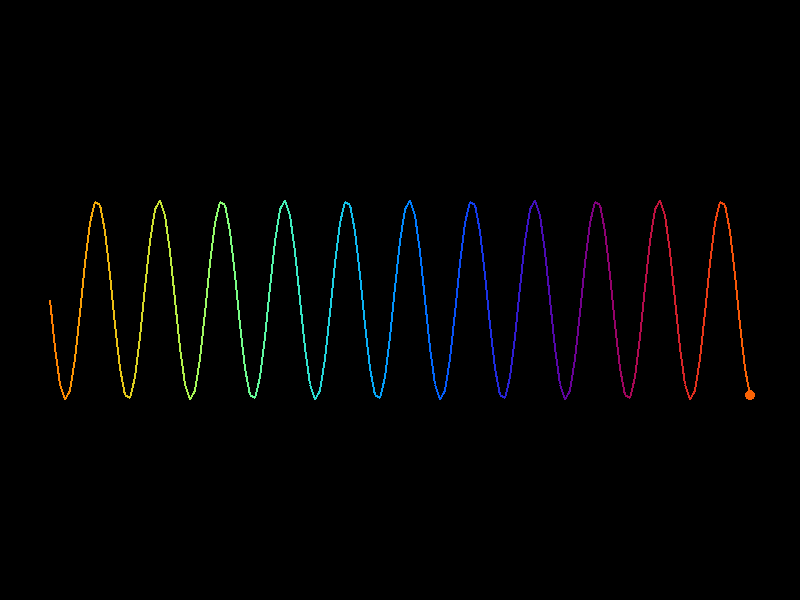

---

## Example 27: Labels + screenshot with `turtle_write_at`, `turtle_screen_size`, `turtle_save_image`

Draw a centered title with `turtle_write_at`, size the layout from
`turtle_screen_size`, then save the canvas to a PNG with `turtle_save_image`
(no need to include `raylib.h`).

```c
#include "turtle/turtle.h"

int main(void) {
    Turtle* t = turtle_create();
    turtle_init_window(420, 420, "c_std turtle");
    turtle_set_fps(60);
    turtle_set_speed(t, 100);
    turtle_set_background_color(t, 255, 255, 255, 255);
    turtle_pen_size(t, 4);

    int w = 0, h = 0;
    turtle_screen_size(&w, &h);                       /* 420 x 420 */
    turtle_write_at(t, w / 2 - 78, 18, "nested squares", 22, (Color){30, 90, 200, 255});

    unsigned char colors[3][3] = {{220, 50, 50}, {40, 160, 60}, {40, 90, 210}};
    for (int s = 0; s < 3; ++s) {
        float side = 90.0f + s * 70.0f;
        turtle_pen_up(t);
        turtle_set_position(t, w / 2.0f - side / 2.0f, h / 2.0f + side / 2.0f + 24.0f);
        turtle_set_heading(t, 0);
        turtle_pen_down(t);
        turtle_set_pen_color_rgb(t, colors[s][0], colors[s][1], colors[s][2], 255);
        for (int i = 0; i < 4; ++i) {
            turtle_forward(t, side);
            turtle_right(t, 90);
        }
    }
    turtle_draw(t);

    turtle_save_image("turtle_labels.png");
    turtle_deallocate(t);
    turtle_close_window();
    return 0;
}
```

**Result:**
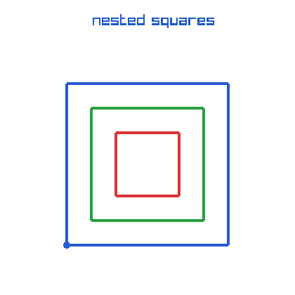

---

## Example 28 : Headless geometry read-back and SVG export with `turtle_get_line` and `turtle_export_svg`

These two functions need **no graphics window**. `turtle_get_line` reads back the exact segments the turtle drew, and `turtle_export_svg` writes a scalable SVG straight from that geometry — so you can produce drawings in CI or on a server without an OpenGL context.

```c
#include "turtle/turtle.h"
#include <stdio.h>

int main(void) {
    Turtle* t = turtle_create();

    /* Draw a triangle — entirely headless, no graphics window needed. */
    turtle_pen_up(t);
    turtle_set_position(t, 100.0f, 100.0f);
    turtle_pen_down(t);
    turtle_set_color(t, 220, 40, 40, 255);
    turtle_pen_size(t, 2.0f);
    turtle_set_position(t, 200.0f, 100.0f);
    turtle_set_position(t, 150.0f, 180.0f);
    turtle_set_position(t, 100.0f, 100.0f);

    int n = turtle_get_line_count(t);
    printf("drew %d line segments\n", n);

    /* Read the recorded geometry back. */
    Line first;
    if (turtle_get_line(t, 0, &first)) {
        printf("line 0: (%.0f,%.0f) -> (%.0f,%.0f)\n",
               first.start.x, first.start.y, first.end.x, first.end.y);
    }

    /* Export to a scalable SVG file — works with no window/OpenGL context. */
    if (turtle_export_svg(t, "triangle.svg")) {
        printf("exported triangle.svg\n");
    }

    turtle_deallocate(t);
    return 0;
}
```

**Result**

```
drew 3 line segments
line 0: (100,100) -> (200,100)
exported triangle.svg
```

The generated `triangle.svg`:

```xml
<?xml version="1.0" encoding="UTF-8"?>
<svg xmlns="http://www.w3.org/2000/svg" viewBox="90 90 120 100">
  <rect x="90" y="90" width="120" height="100" fill="#ffffff"/>
  <line x1="100" y1="100" x2="200" y2="100" stroke="#dc2828" stroke-width="2" stroke-linecap="round"/>
  <line x1="200" y1="100" x2="150" y2="180" stroke="#dc2828" stroke-width="2" stroke-linecap="round"/>
  <line x1="150" y1="180" x2="100" y2="100" stroke="#dc2828" stroke-width="2" stroke-linecap="round"/>
</svg>
```

---

## License

This project is open-source and available under [ISC License].